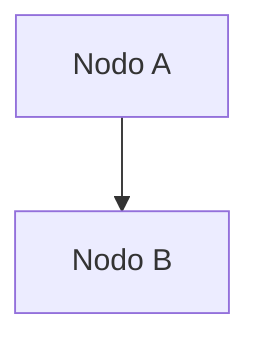

# 🚀 Quick Start Guide

Cómo ejecutar la documentación de Post-Message.

## Windows - Opción 1: Batch File (Recomendado)

Haz doble clic en el archivo:

```
setup-docs.bat
```

Aparecerá un menú con opciones:
- 1️⃣ Iniciar servidor (desarrollo)
- 2️⃣ Build para producción
- 3️⃣ Servir documentación
- 4️⃣ Limpiar cache
- 5️⃣ Salir

El script automáticamente:
- ✅ Verifica que Node.js esté instalado
- ✅ Instala dependencias si falta
- ✅ Inicia el servidor en `http://localhost:3000`

## Windows - Opción 2: PowerShell (Más avanzado)

Abre PowerShell en el directorio y ejecuta:

```powershell
Set-ExecutionPolicy -ExecutionPolicy RemoteSigned -Scope CurrentUser
.\setup-docs.ps1
```

(Solo necesitas ejecutar `Set-ExecutionPolicy` una vez)

Aparecerá un menú interactivo con más opciones:
- 1️⃣ Iniciar servidor
- 2️⃣ Build para producción
- 3️⃣ Servir documentación
- 4️⃣ Limpiar cache
- 5️⃣ Actualizar dependencias
- 6️⃣ Salir

## Windows - Opción 3: Manual (Command Prompt)

```bash
# Instalar dependencias
npm install

# Iniciar servidor de desarrollo
npm run start
```

La documentación abrirá en `http://localhost:3000`

## macOS / Linux

```bash
# Instalar dependencias
npm install

# Iniciar servidor
npm start
```

O:

```bash
npm run start:dev
```

## Primeros Pasos

### 1. **Instalación (primera vez)**

```bash
npm install
```

Esto instalará:
- Docusaurus 3
- React 18
- Todas las dependencias necesarias

### 2. **Desarrollo (editar documentación)**

```bash
npm run start
```

- 🌐 Abre `http://localhost:3000`
- 📝 Los cambios en `/docs` se reflejan automáticamente
- ⚡ Hot reload activado

### 3. **Build para Producción**

```bash
npm run build
```

Genera:
- 📦 Carpeta `/build` con sitio estático
- ⚡ Optimizado y minificado
- 🚀 Listo para deploy

### 4. **Servir Build Local**

```bash
npm run serve
```

Sirve el build de producción en `http://localhost:3000`

## Estructura de Carpetas

```
docs-post-message/
├── docs/                     # 📚 Archivos markdown
│   └── backend/             # Documentación del backend
│       ├── intro.md
│       ├── architecture/
│       ├── modules/
│       ├── core/
│       ├── database/
│       ├── utils/
│       ├── config/
│       ├── websocket/
│       └── issues/
├── src/
│   └── css/
│       └── custom.css       # 🎨 Estilos personalizados
├── sidebars.js              # 📑 Navegación del sidebar
├── docusaurus.config.js     # ⚙️ Configuración principal
├── package.json             # 📦 Dependencias
├── setup-docs.bat           # 🪟 Script Windows (Batch)
├── setup-docs.ps1           # 💻 Script Windows (PowerShell)
└── README.md                # 📖 Documentación principal
```

## Troubleshooting

### Error: "npm: command not found"

**Solución**: Node.js no está instalado

```
Descarga: https://nodejs.org/
```

### Error: "Cannot find module"

**Solución**: Reinstala dependencias

```bash
rm -r node_modules
npm install
```

### Error: "Port 3000 already in use"

**Solución**: Otra aplicación usa el puerto

```bash
# Windows: Busca el proceso
netstat -ano | findstr :3000

# macOS/Linux: Mata el proceso
lsof -ti:3000 | xargs kill -9
```

### Build lento o error de memoria

**Solución**: Aumenta memoria de Node

```bash
# Windows (Command Prompt)
set NODE_OPTIONS=--max-old-space-size=4096
npm run build

# macOS/Linux (Bash)
export NODE_OPTIONS=--max-old-space-size=4096
npm run build
```

## Comandos Disponibles

| Comando | Descripción |
|---------|-------------|
| `npm start` | Iniciar dev server (hot reload) |
| `npm run build` | Build para producción |
| `npm run serve` | Servir build local |
| `npm run clear` | Limpiar cache |
| `npm run swizzle` | Personalizar componentes |
| `npm run write-translations` | Generar archivos de traducción |

## Editando Documentación

### Agregar una Nueva Página

1. Crea un archivo `.md` en `docs/backend/` (o subcarpeta)
2. Agrega frontmatter al inicio:

```markdown
---
sidebar_position: 1
title: Mi Página
description: Descripción breve
---

# Título

Contenido aquí...
```

3. Docusaurus la agregará automáticamente al sidebar

### Agregar Diagrama Mermaid

```markdown

```

### Agregar Código

```markdown
```typescript
// Código aquí
const user = await getUser(id);
```
```

### Crear Link Interno

```markdown
[Ir a Modules →](../modules/auth.md)
```

## Configuración

### Cambiar Puerto

En `docusaurus.config.js`:

```javascript
// No hay config de puerto aquí, pero puedes hacer:
npm start -- --port 8080
```

### Agregar Idioma

En `docusaurus.config.js`, en `i18n`:

```javascript
i18n: {
  defaultLocale: 'en',
  locales: ['en', 'es', 'fr'],  // Agrega 'fr'
  localeConfigs: {
    fr: { label: 'Français' },
  },
}
```

### Personalizar Colores

En `src/css/custom.css`:

```css
:root {
  --ifm-color-primary: #2E86AB;  /* Cambiar color primario */
}
```

## Deployment

### Vercel (Recomendado)

```bash
npm run build
vercel
```

### GitHub Pages

```bash
# Configura en docusaurus.config.js
npm run build
git add build/
git commit -m "docs: deploy"
git push
```

### Netlify

```bash
npm run build
# Arrastra la carpeta /build a Netlify
```

## Próximos Pasos

1. 📖 Lee la [documentación principal](README.md)
2. 🏗️ Explora la [arquitectura del backend](docs/backend/intro.md)
3. 🐛 Revisa los [problemas conocidos](docs/backend/issues/)
4. 🤝 Contribuye con cambios

## ¿Necesitas Ayuda?

- 📖 [README.md](README.md) — Guía completa
- 🔗 [Docusaurus Docs](https://docusaurus.io/docs/intro)
- 🐛 [Known Issues](docs/backend/issues/)

---

**Happy documenting! 📚**
