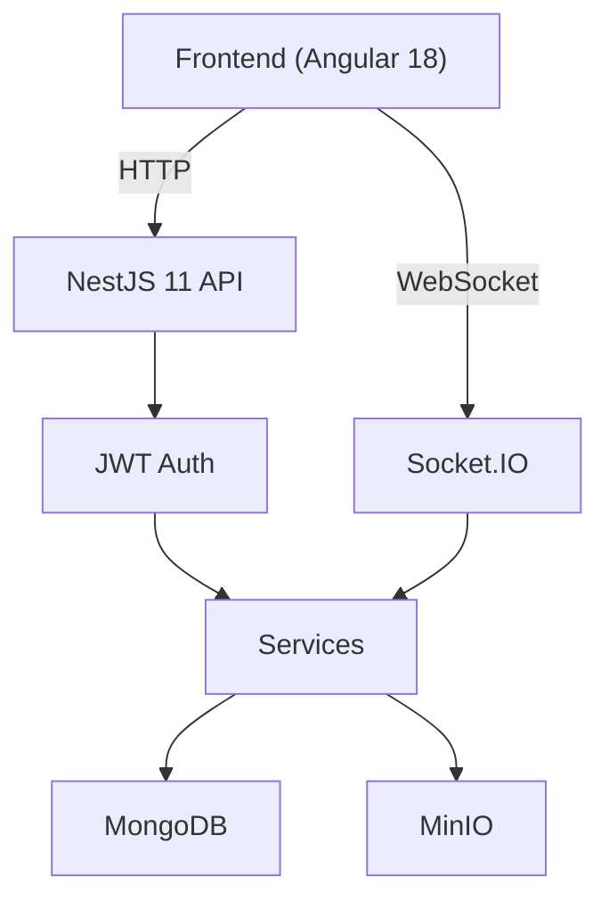

# Post-Message Documentation

Complete documentation for the Post-Message backend (NestJS 11) and frontend (Angular 18) using Docusaurus.

## Contents

### Cross-Stack Guides

- **[Environment Variables Guide](docs/ENV_GUIDE.md)** — All backend env vars, docker-compose substitution vars, frontend compile-time config, environment matrix, and security notes
- **[Docker Guide](docs/DOCKER_GUIDE.md)** — Full-stack Docker Compose setup, service table, useful commands, health checks, and volumes
- **[Testing Strategy](docs/TESTING_GUIDE.md)** — Jest (backend), Karma/Jasmine (frontend), Cypress e2e, and how to run all suites

### Backend Documentation

- **[Introduction](docs/backend/intro.md)** — Backend overview and tech stack
- **[Architecture](docs/backend/architecture/)** — System design and patterns
  - Overview with diagrams
  - Layered architecture explanation
  - Module structure and dependencies
- **[Modules](docs/backend/modules/)** — Feature modules documentation
  - Auth — JWT authentication
  - Users — User management with Clean Architecture
  - Posts — Blog post CRUD
  - Comments — Comments with WebSocket support
  - Clients — Client management
  - Files — File upload with MinIO
  - Roles & Permissions — RBAC system
  - I18n — Internationalization
- **[Core Features](docs/backend/core/)** — Infrastructure components
  - Guards — Authentication and authorization
  - Interceptors — Response transformation
  - Filters — Exception handling
  - Decorators — Custom decorators
  - Middleware — Request preprocessing
- **[Database](docs/backend/database/)** — MongoDB schemas and relationships
  - Complete schema definitions
  - Entity relationships
  - Population patterns
- **[Utilities](docs/backend/utils/)** — Helper utilities
  - Crypto (password hashing)
  - File operations
  - String manipulation
  - Input validation
- **[Configuration](docs/backend/config/)** — Setup and environment
  - Environment variables
  - Getting started guide
- **[Real-Time](docs/backend/websocket/)** — WebSocket features
  - Comments gateway
  - Security considerations
- **[Known Issues](docs/backend/issues/)** — Technical debt and improvements
  - Hardcoded secrets
  - Orphaned modules
  - WebSocket authentication
  - i18n inconsistency

### Frontend Documentation

- **[Introduction](docs/frontend/intro.md)** — Angular 18 frontend overview and tech stack
- **[Setup](docs/frontend/setup/index.md)** — Local development and Docker setup for the frontend

## Getting Started

### Prerequisites

- Node.js 18+
- npm or yarn

### Installation

```bash
# Install dependencies
npm install

# Start development server
npm run start

# The docs will be available at http://localhost:3000
```

### Building for Production

```bash
# Build static site
npm run build

# Serve built site locally
npm run serve

# Deploy to production
npm run deploy
```

## Features

- **Interactive Diagrams** — Mermaid diagrams for architecture visualization
- **Code Examples** — Practical code snippets throughout
- **Search** — Full-text search across all documentation
- **Versioning** — Support for multiple documentation versions
- **i18n Ready** — English and Spanish support (ready to expand)
- **Responsive** — Mobile-friendly design

## Key Sections

### For Backend Developers

- Start with [Backend Introduction](docs/backend/intro.md)
- Read [Architecture Overview](docs/backend/architecture/overview.md)
- Explore [Module Structure](docs/backend/architecture/module-structure.md)
- Check [Setup Guide](docs/backend/config/setup.md)

### For Frontend Developers

- Start with [Frontend Introduction](docs/frontend/intro.md)
- Check [Frontend Setup](docs/frontend/setup/index.md)
- Review [Environment Variables Guide](docs/ENV_GUIDE.md) for compile-time config
- See [Testing Strategy](docs/TESTING_GUIDE.md) for Karma and Cypress setup

### For Architects

- Review [Architecture Overview](docs/backend/architecture/overview.md)
- Study [Layers Explanation](docs/backend/architecture/layers.md)
- Examine [Known Issues](docs/backend/issues/) for improvement opportunities

### For DevOps

- See [Docker Guide](docs/DOCKER_GUIDE.md) for full-stack container setup
- Check [Environment Variables Guide](docs/ENV_GUIDE.md) for all configuration
- Review [Database Setup](docs/backend/database/schemas.md)

## Architecture at a Glance



## Known Issues

The backend has some technical debt:

1. **Hardcoded JWT Secret** — See [issue details](docs/backend/issues/hardcoded-secrets.md)
2. **Orphaned Modules** — See [issue details](docs/backend/issues/orphaned-modules.md)
3. **WebSocket Auth Gap** — See [issue details](docs/backend/issues/ws-auth.md)
4. **i18n Duplication** — See [issue details](docs/backend/issues/i18n-inconsistency.md)

All issues are documented with recommended fixes.

## Documentation Structure

```
docs/
├── ENV_GUIDE.md                    # Environment variables (backend + frontend + Docker)
├── DOCKER_GUIDE.md                 # Docker Compose full-stack guide
├── TESTING_GUIDE.md                # Testing strategy and commands
├── backend/
│   ├── intro.md                    # Start here
│   ├── architecture/               # System design
│   │   ├── overview.md
│   │   ├── layers.md
│   │   └── module-structure.md
│   ├── modules/                    # Feature modules
│   │   ├── auth.md
│   │   ├── users.md
│   │   ├── posts.md
│   │   ├── comments.md
│   │   ├── files.md
│   │   ├── clients.md
│   │   ├── roles-permissions.md
│   │   └── i18n.md
│   ├── core/                       # Infrastructure
│   │   ├── guards.md
│   │   ├── interceptors.md
│   │   ├── filters.md
│   │   ├── decorators.md
│   │   └── middleware.md
│   ├── database/                   # Data layer
│   │   ├── schemas.md
│   │   └── relationships.md
│   ├── utils/                      # Utilities
│   │   ├── crypto.md
│   │   ├── file.md
│   │   ├── string.md
│   │   └── validation.md
│   ├── config/                     # Configuration
│   │   ├── environment.md
│   │   └── setup.md
│   ├── websocket/                  # Real-time
│   │   ├── comments-gateway.md
│   │   └── security.md
│   └── issues/                     # Known issues
│       ├── hardcoded-secrets.md
│       ├── orphaned-modules.md
│       ├── ws-auth.md
│       └── i18n-inconsistency.md
└── frontend/
    ├── intro.md                    # Frontend overview
    └── setup/
        └── index.md               # Frontend setup
```

## Important Links

- **Backend**: `../backend-post-message-nestjs/`
- **Frontend**: `../frontend-post-message-angular/`
- **Main Repository**: `../`

## Diagrams and Visualizations

This documentation uses Mermaid diagrams for:

- Architecture and module dependencies
- Data flow and request processing
- Database relationships (ER diagrams)
- Security and authentication flows
- WebSocket event handling

All diagrams render automatically in Docusaurus.

## Responsive Design

- Full desktop support
- Tablet-optimized navigation
- Mobile-friendly layouts
- Dark mode support

## Multi-Language Support

Currently available:
- **English** (default)
- **Spanish** (Español)

To add more languages, update `docusaurus.config.js` i18n config.

## Contributing

To add or update documentation:

1. Edit `.md` files in the `docs/` directory
2. Use Mermaid diagrams for visualizations
3. Include code examples
4. Add links to related sections
5. Test locally with `npm run start`

## License

Documentation is part of the Post-Message project.

---

**Last Updated**: June 2026
**Backend Version**: NestJS 11
**Frontend Version**: Angular 18
**Status**: Complete backend documentation + Frontend documentation
