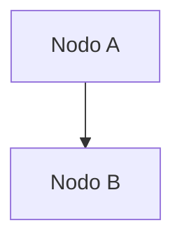

# 🔧 Troubleshooting Guide

Soluciones para problemas comunes al ejecutar la documentación.

## Error: "Cannot find package 'chalk'"

```
Error: Cannot find package 'C:\Users\...\node_modules\update-notifier\node_modules\chalk\index.js'
```

### Causas
- Conflicto de versiones de dependencias
- npm cache corrupto
- Instalación incompleta

### Solución ✅

**Opción 1: Ejecutar script de limpieza (Recomendado)**

```bash
clean-install.bat
```

Este script:
1. Limpia el cache de npm
2. Elimina `node_modules` y `package-lock.json`
3. Reinstala dependencias
4. Inicia automáticamente el servidor

**Opción 2: Manual (Command Prompt)**

```bash
# 1. Limpiar cache
npm cache clean --force

# 2. Eliminar node_modules
rmdir /s /q node_modules

# 3. Eliminar lock file
del package-lock.json

# 4. Reinstalar
npm install --legacy-peer-deps

# 5. Iniciar
npm run start
```

**Opción 3: PowerShell**

```powershell
# Limpiar todo
npm cache clean --force
Remove-Item -Recurse -Force node_modules
Remove-Item package-lock.json
npm install --legacy-peer-deps
npm run start
```

---

## Error: "npm: command not found"

### Causas
- Node.js no está instalado
- npm no está en el PATH

### Solución ✅

1. Descarga Node.js desde: https://nodejs.org/
2. Instala con las opciones por defecto
3. Reinicia Command Prompt/PowerShell
4. Verifica: `node --version` y `npm --version`

---

## Error: "Port 3000 already in use"

```
Error: listen EADDRINUSE: address already in use :::3000
```

### Causas
- Otra instancia de Docusaurus está ejecutándose
- Otro programa usa el puerto 3000

### Solución ✅

**Windows (Command Prompt)**

```bash
# Encontrar proceso en puerto 3000
netstat -ano | findstr :3000

# Si encuentra PID (ej: 12345), mata el proceso
taskkill /PID 12345 /F

# O especifica otro puerto
npm start -- --port 3001
```

**Windows (PowerShell)**

```powershell
# Encontrar y matar proceso
Get-Process | Where-Object {$_.Handles -like "*3000*"} | Stop-Process -Force

# O usa otro puerto
npm start -- --port 3001
```

**macOS/Linux**

```bash
# Matar proceso en puerto 3000
lsof -ti:3000 | xargs kill -9

# O usa otro puerto
npm start -- --port 3001
```

---

## Error: "Out of memory"

```
JavaScript heap out of memory
```

### Causas
- Build muy grande
- Memoria RAM insuficiente

### Solución ✅

**Aumentar memoria de Node.js**

```bash
# Windows (Command Prompt)
set NODE_OPTIONS=--max-old-space-size=4096
npm run build

# Windows (PowerShell)
$env:NODE_OPTIONS = "--max-old-space-size=4096"
npm run build

# macOS/Linux
export NODE_OPTIONS=--max-old-space-size=4096
npm run build
```

---

## Error: "ENOSPC: no space left on device"

### Causas
- Disco duro lleno
- Espacio insuficiente para node_modules

### Solución ✅

1. Libera espacio en disco (al menos 2GB)
2. Limpia el cache de npm:

```bash
npm cache clean --force
npm cache prune
```

3. Reinstala dependencias

---

## Docusaurus no genera cambios automáticamente

### Causas
- Hot reload desactivado
- Problemas de sistema de archivos

### Solución ✅

1. Detén el servidor (Ctrl+C)
2. Ejecuta `npm run clear`
3. Reinicia con `npm run start`

Si persiste:
```bash
npm cache clean --force
npm install --legacy-peer-deps
npm run start
```

---

## Build muy lento

### Causas
- Muchos archivos markdown
- Dependencias sin optimizar

### Soluciones ✅

1. **Aumenta memoria**:
```bash
set NODE_OPTIONS=--max-old-space-size=4096
npm run build
```

2. **Limpia antes de build**:
```bash
npm run clear
npm run build
```

3. **Aumenta timeout** (edit package.json scripts):
```json
"build": "docusaurus build --max-workers 2"
```

---

## Error: "Document not found"

```
Error: Document with path ... not found
```

### Causas
- Archivo markdown no existe
- Ruta en sidebar.js incorrecta

### Solución ✅

1. Verifica que el archivo `.md` existe
2. Checa que la ruta en `sidebars.js` es correcta
3. Reinicia el servidor

**Ejemplo correcto**:
```js
sidebars: {
  tutorialSidebar: [
    'backend/intro',           // Busca: docs/backend/intro.md
    'backend/architecture/overview',  // Busca: docs/backend/architecture/overview.md
  ]
}
```

---

## Error: "Module not found"

```
Error: Cannot find module '@docusaurus/...'
```

### Solución ✅

Reinstala limpiamente:

```bash
npm cache clean --force
rmdir /s /q node_modules
del package-lock.json
npm install --legacy-peer-deps
```

---

## Mermaid diagrams no se renderizan

### Causas
- Plugin no instalado
- Sintaxis incorrecta

### Solución ✅

Asegúrate de que Docusaurus está actualizado:

```bash
npm update @docusaurus/core @docusaurus/preset-classic
```

Verifica la sintaxis del diagrama:
```markdown

```

---

## "Cannot find module 'chalk'"

Este es el error principal que encontraste. Usa el script `clean-install.bat`:

```bash
clean-install.bat
```

Si eso no funciona, ejecuta:

```bash
npm cache clean --force
rmdir /s /q node_modules
del package-lock.json
npm install --legacy-peer-deps
npm start
```

---

## Nada de lo anterior funciona

### Plan B: Reinstalación completa

```bash
# 1. Limpia completamente
npm cache clean --force
rmdir /s /q node_modules
rmdir /s /q .docusaurus
rmdir /s /q build
del package-lock.json

# 2. Reinstala
npm install --legacy-peer-deps

# 3. Intenta de nuevo
npm run clear
npm run start
```

Si aún falla, verifica:
- Node.js versión: `node --version` (debe ser 18+)
- npm versión: `npm --version` (debe ser 8+)
- Espacio en disco: al menos 2GB libre

---

## ¿Todavía hay problemas?

1. Ejecuta: `npm audit` para ver vulnerabilidades
2. Verifica los logs completos
3. Prueba en otra carpeta (para aislar problemas del sistema)
4. Consulta [Docusaurus Issues](https://github.com/facebook/docusaurus/issues)

---

**Última actualización**: June 13, 2024
