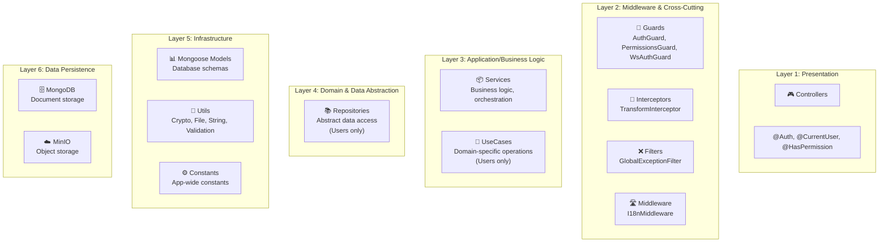
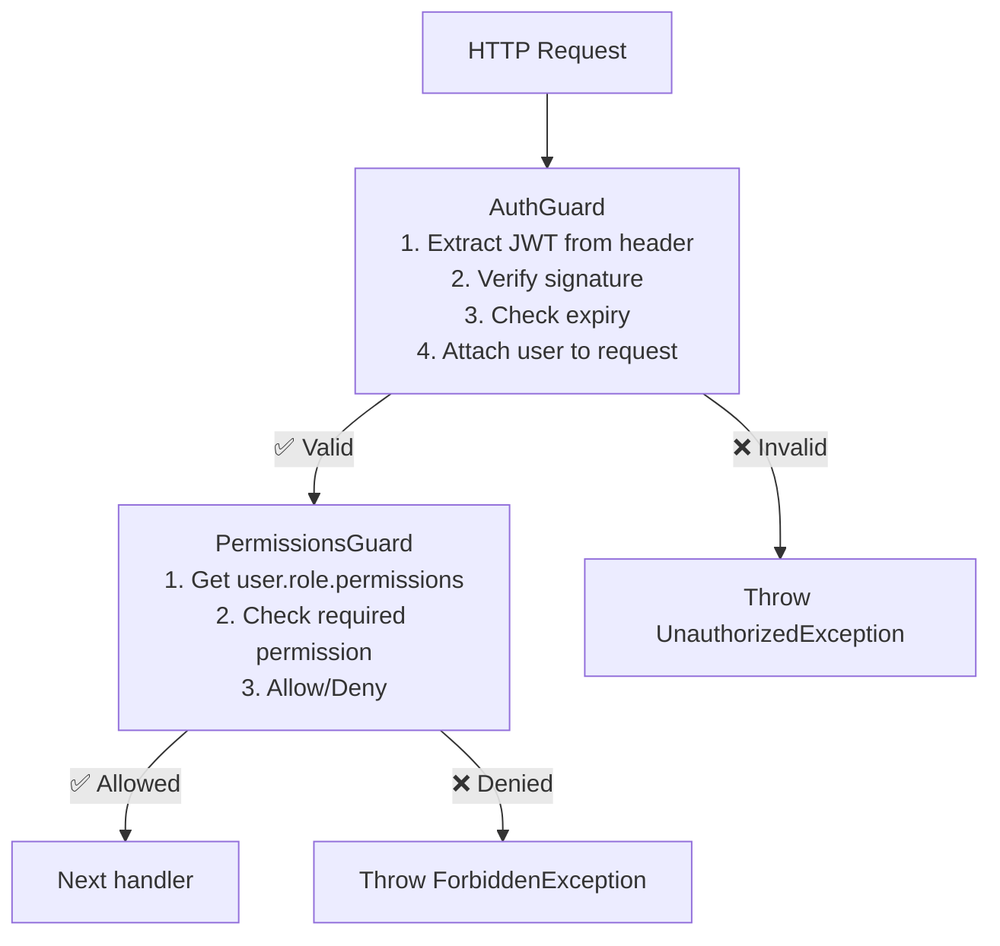
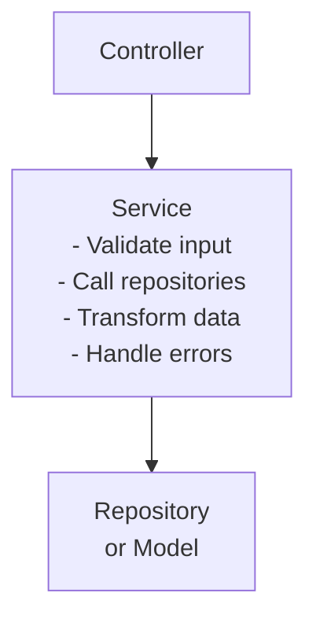
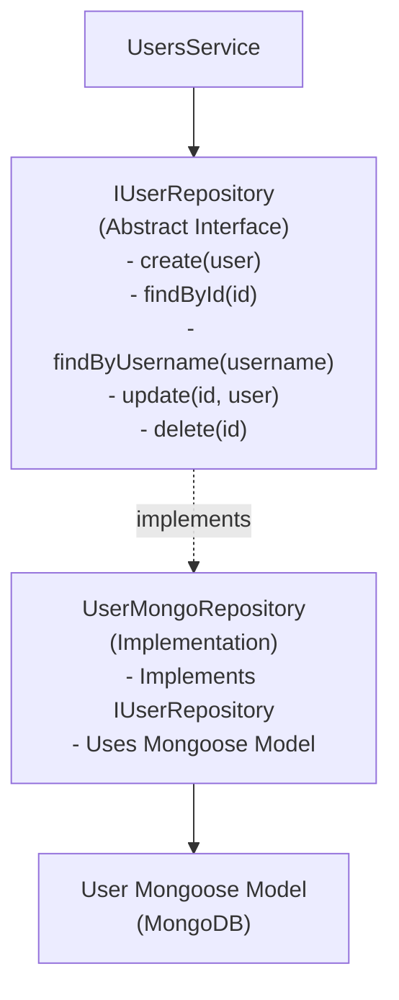
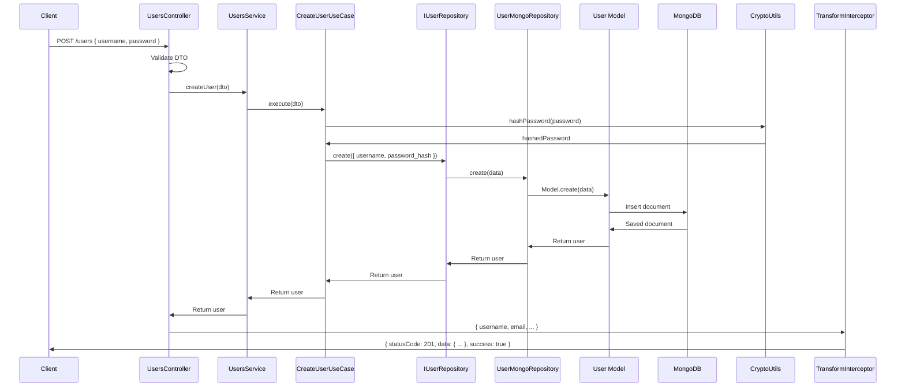

# Layer Architecture

The Post-Message backend follows a **layered architecture** pattern with clear separation of concerns.

## Overview



## Layer Details

### Layer 1: Presentation (Controllers)

Controllers handle HTTP requests and responses. They:

- Accept HTTP requests from clients
- Parse request parameters, body, and headers
- Delegate business logic to Services
- Return HTTP responses

**Example**:
```typescript
@Controller('users')
export class UsersController {
  constructor(private usersService: UsersService) {}

  @Get(':id')
  @Auth()  // Custom decorator
  async findOne(@Param('id') id: string, @CurrentUser() user: CurrentUserPayload) {
    return this.usersService.findUserById(id);
  }
}
```

**Files**: `src/app/modules/*/controllers/*.controller.ts`

### Layer 2: Cross-Cutting Concerns

This layer provides infrastructure services used across the application:

#### Guards 🔐
Protect routes and verify authentication/authorization.



**Files**:
- `src/app/core/guards/auth.guard.ts` — JWT verification
- `src/app/core/guards/permissions.guard.ts` — RBAC enforcement
- `src/app/core/guards/ws-auth.guard.ts` — WebSocket JWT verification (unused)

#### Interceptors 🔄
Transform requests/responses before reaching the handler or after the response.

```typescript
@Injectable()
export class TransformInterceptor implements NestInterceptor {
  intercept(context: ExecutionContext, next: CallHandler) {
    return next.handle().pipe(
      map(data => ({
        statusCode: 200,
        data,
        timestamp: new Date(),
        success: true,
      }))
    );
  }
}
```

**Files**: `src/app/core/interceptors/transform.interceptor.ts`

#### Filters ❌
Handle exceptions globally and format error responses.

```typescript
@Catch()
export class GlobalExceptionFilter implements ExceptionFilter {
  catch(exception: unknown, host: ArgumentsHost) {
    // Extract exception type
    // Format error response
    // Return JSON with statusCode, message, errors
  }
}
```

**Files**: `src/app/core/filters/global-exception.filter.ts`

#### Middleware 🛣️
Process requests before they reach controllers (e.g., language detection).

```typescript
export class I18nMiddleware implements NestMiddleware {
  use(req: Request, res: Response, next: NextFunction) {
    const language = req.headers['accept-language'] || 'en';
    req['language'] = language;
    next();
  }
}
```

**Files**: `src/app/core/middleware/i18n.middleware.ts`

### Layer 3: Application/Business Logic

#### Services 📦
Contain the core business logic and orchestrate operations.



**Characteristics**:
- Pure business logic (no HTTP knowledge)
- Can be tested independently
- Should be reusable across controllers

**Example**:
```typescript
@Injectable()
export class UsersService {
  constructor(
    private userRepository: IUserRepository,
    private cryptoUtils: CryptoUtils,
  ) {}

  async createUser(dto: CreateUserDto) {
    const hashedPassword = await this.cryptoUtils.hashPassword(dto.password);
    return this.userRepository.create({
      ...dto,
      password_hash: hashedPassword,
    });
  }
}
```

**Files**: `src/app/modules/*/services/*.service.ts`

#### Use Cases 🎯 (Users Module Only)
Business logic functions that implement specific user operations.


**Files**: `src/app/modules/users/use-cases/`

### Layer 4: Domain & Data Abstraction

#### Repositories 📚 (Users Module Only)
Abstract the data access layer. Implement the repository pattern.



**Benefits**:
- Database layer is abstracted
- Easy to swap MongoDB for PostgreSQL
- Testable with mock repositories

**Files**: `src/app/modules/users/repositories/`

### Layer 5: Infrastructure

#### Models 📊
Mongoose schemas define the structure of MongoDB documents.

```typescript
@Schema({ timestamps: true })
export class User {
  @Prop({ required: true, unique: true })
  username: string;

  @Prop({ required: true })
  password_hash: string;

  @Prop({ type: Schema.Types.ObjectId, ref: 'Role' })
  role: Role;
}
```

**Files**: `src/app/modules/*/schemas/*.schema.ts`

#### Utils 🧰
Reusable utility functions for common operations.

- `CryptoUtils` — Password hashing/comparison
- `FileUtils` — File naming and validation
- `StringUtils` — String manipulation
- `ArrayUtils` — Array operations
- `DateUtils` — Date formatting
- `ValidationUtils` — Input validation

**Files**: `src/app/core/utils/`

#### Constants ⚙️
Application-wide constants.

**Files**: `src/app/core/constants/`

### Layer 6: Data Persistence

#### MongoDB 🗄️
Document-oriented database for storing user, post, comment data.

#### MinIO ☁️
Object storage for file uploads.

## Data Flow Example: Create User



## Common Patterns

### Pattern 1: Dependency Injection
```typescript
@Injectable()
export class MyService {
  constructor(
    private otherService: OtherService,
    private repository: IMyRepository,
  ) {}
}
```

### Pattern 2: Decorator for Metadata
```typescript
@Controller('users')
@UseGuards(AuthGuard)  // Apply guard
@UseInterceptors(TransformInterceptor)  // Apply interceptor
export class UsersController {
  @Get(':id')
  @Auth()  // Custom decorator
  findOne(@Param('id') id: string) {}
}
```

### Pattern 3: Error Handling
```typescript
try {
  return this.service.doSomething();
} catch (error) {
  throw new BadRequestException(error.message);  // Caught by GlobalExceptionFilter
}
```

## Layer Responsibilities

| Layer | Responsibility | Should Know About |
|-------|-----------------|-------------------|
| Controller | Route handling, HTTP concerns | HTTP, DTOs, Services |
| Service | Business logic, orchestration | Domain logic, Repositories |
| Use Case | Specific business operations | Domain logic, Repository |
| Repository | Data abstraction | Database operations, Models |
| Model | Data structure | Database schema, validation |

## Violation Points

⚠️ **Current architecture violates these principles**:

1. **Modules 2-7 bypass Domain/Use-Case layers**: They go directly Service → Model
2. **WsAuthGuard defined but unused**: Doesn't protect WebSocket mutations
3. **Dual i18n systems**: Both Singleton and Request-scoped services exist

See [Known Issues](../issues/orphaned-modules.md) for details.

---

**Next**: [Module Structure →](./module-structure.md)
