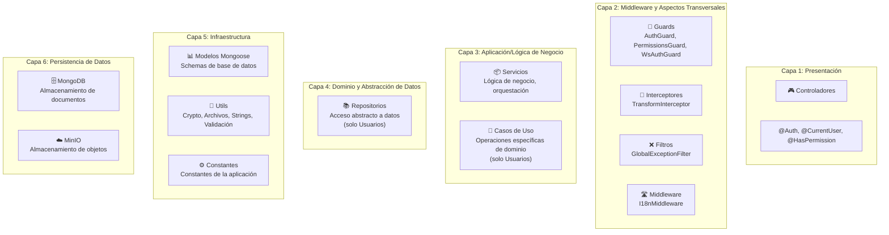
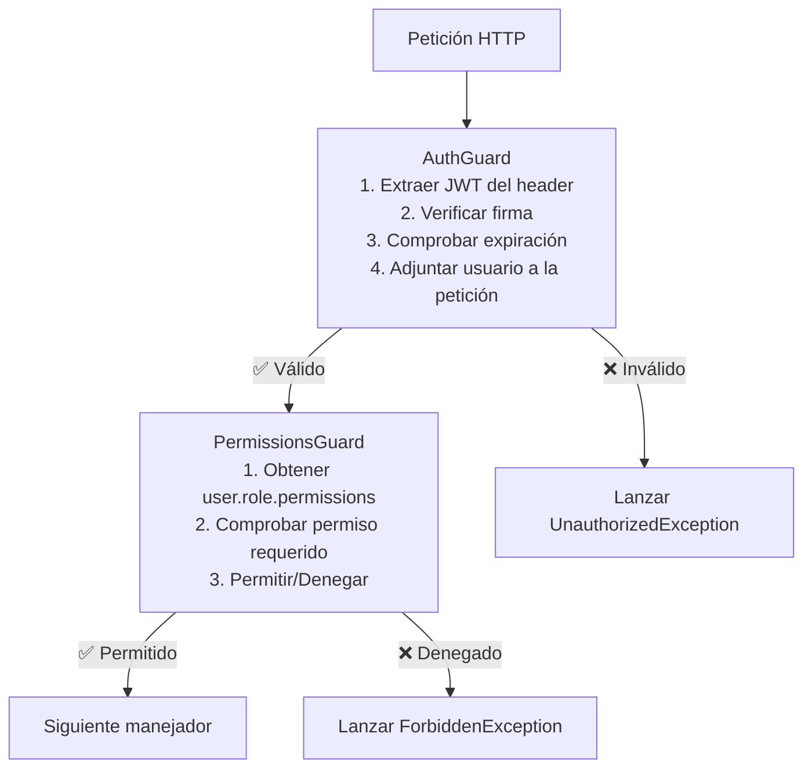
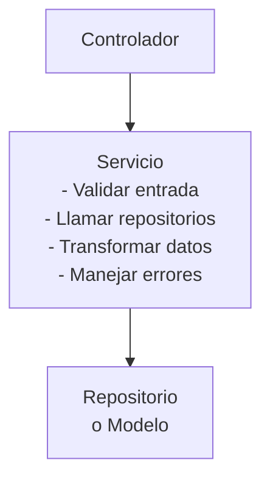
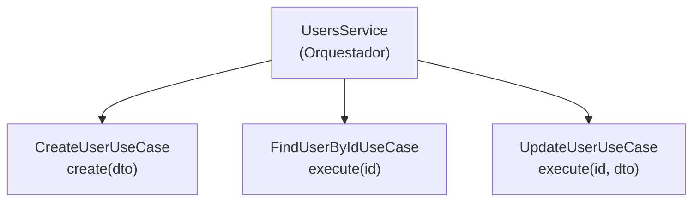
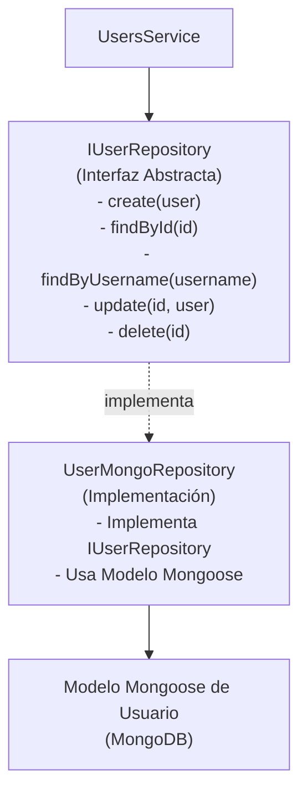
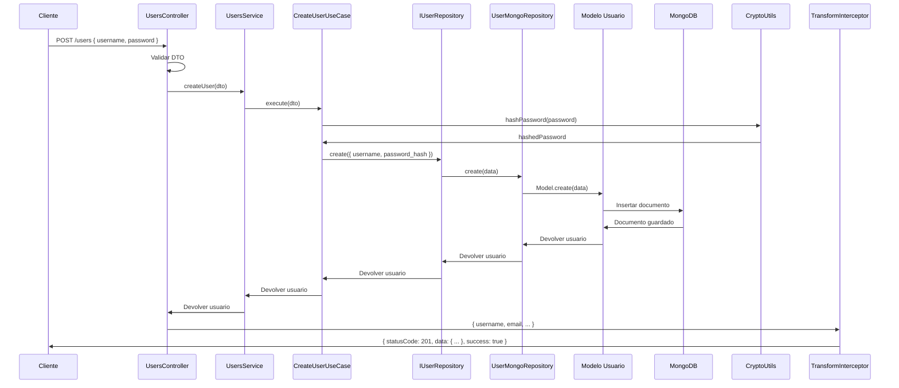

# Arquitectura en Capas

El backend de Post-Message sigue un patrón de **arquitectura en capas** con clara separación de responsabilidades.

## Descripción General



## Detalle de Capas

### Capa 1: Presentación (Controladores)

Los controladores manejan peticiones y respuestas HTTP. Ellos:

- Aceptan peticiones HTTP de los clientes
- Parsean parámetros, cuerpo y headers de las peticiones
- Delegan la lógica de negocio a los Servicios
- Devuelven respuestas HTTP

**Ejemplo**:
```typescript
@Controller('users')
export class UsersController {
  constructor(private usersService: UsersService) {}

  @Get(':id')
  @Auth()  // Decorador personalizado
  async findOne(@Param('id') id: string, @CurrentUser() user: CurrentUserPayload) {
    return this.usersService.findUserById(id);
  }
}
```

**Archivos**: `src/app/modules/*/controllers/*.controller.ts`

### Capa 2: Aspectos Transversales

Esta capa provee servicios de infraestructura usados en toda la aplicación:

#### Guards 🔐
Protegen rutas y verifican autenticación/autorización.



**Archivos**:
- `src/app/core/guards/auth.guard.ts` — Verificación JWT
- `src/app/core/guards/permissions.guard.ts` — Aplicación de RBAC
- `src/app/core/guards/ws-auth.guard.ts` — Verificación JWT para WebSocket (sin uso)

#### Interceptores 🔄
Transforman peticiones/respuestas antes de llegar al manejador o después de la respuesta.

```typescript
@Injectable()
export class TransformInterceptor implements NestInterceptor {
  intercept(context: ExecutionContext, next: CallHandler) {
    return next.handle().pipe(
      map(data => ({
        statusCode: 200,
        data,
        timestamp: new Date(),
        success: true,
      }))
    );
  }
}
```

**Archivos**: `src/app/core/interceptors/transform.interceptor.ts`

#### Filtros ❌
Manejan excepciones globalmente y formatean respuestas de error.

```typescript
@Catch()
export class GlobalExceptionFilter implements ExceptionFilter {
  catch(exception: unknown, host: ArgumentsHost) {
    // Extraer tipo de excepción
    // Formatear respuesta de error
    // Devolver JSON con statusCode, message, errors
  }
}
```

**Archivos**: `src/app/core/filters/global-exception.filter.ts`

#### Middleware 🛣️
Procesa peticiones antes de que lleguen a los controladores (ej. detección de idioma).

```typescript
export class I18nMiddleware implements NestMiddleware {
  use(req: Request, res: Response, next: NextFunction) {
    const language = req.headers['accept-language'] || 'en';
    req['language'] = language;
    next();
  }
}
```

**Archivos**: `src/app/core/middleware/i18n.middleware.ts`

### Capa 3: Aplicación/Lógica de Negocio

#### Servicios 📦
Contienen la lógica de negocio central y orquestan operaciones.



**Características**:
- Lógica de negocio pura (sin conocimiento de HTTP)
- Pueden probarse de forma independiente
- Deben ser reutilizables entre controladores

**Ejemplo**:
```typescript
@Injectable()
export class UsersService {
  constructor(
    private userRepository: IUserRepository,
    private cryptoUtils: CryptoUtils,
  ) {}

  async createUser(dto: CreateUserDto) {
    const hashedPassword = await this.cryptoUtils.hashPassword(dto.password);
    return this.userRepository.create({
      ...dto,
      password_hash: hashedPassword,
    });
  }
}
```

**Archivos**: `src/app/modules/*/services/*.service.ts`

#### Casos de Uso 🎯 (Solo Módulo Usuarios)
Funciones de lógica de negocio que implementan operaciones específicas de usuario.



**Archivos**: `src/app/modules/users/use-cases/`

### Capa 4: Dominio y Abstracción de Datos

#### Repositorios 📚 (Solo Módulo Usuarios)
Abstraen la capa de acceso a datos. Implementan el patrón repositorio.



**Beneficios**:
- La capa de base de datos está abstraída
- Fácil de cambiar MongoDB por PostgreSQL
- Testeable con repositorios mock

**Archivos**: `src/app/modules/users/repositories/`

### Capa 5: Infraestructura

#### Modelos 📊
Los schemas de Mongoose definen la estructura de los documentos MongoDB.

```typescript
@Schema({ timestamps: true })
export class User {
  @Prop({ required: true, unique: true })
  username: string;

  @Prop({ required: true })
  password_hash: string;

  @Prop({ type: Schema.Types.ObjectId, ref: 'Role' })
  role: Role;
}
```

**Archivos**: `src/app/modules/*/schemas/*.schema.ts`

#### Utils 🧰
Funciones utilitarias reutilizables para operaciones comunes.

- `CryptoUtils` — Hasheo/comparación de contraseñas
- `FileUtils` — Nomenclatura y validación de archivos
- `StringUtils` — Manipulación de cadenas
- `ArrayUtils` — Operaciones con arrays
- `DateUtils` — Formateo de fechas
- `ValidationUtils` — Validación de entradas

**Archivos**: `src/app/core/utils/`

#### Constantes ⚙️
Constantes de la aplicación.

**Archivos**: `src/app/core/constants/`

### Capa 6: Persistencia de Datos

#### MongoDB 🗄️
Base de datos orientada a documentos para almacenar datos de usuarios, posts y comentarios.

#### MinIO ☁️
Almacenamiento de objetos para subida de archivos.

## Ejemplo de Flujo de Datos: Crear Usuario



## Patrones Comunes

### Patrón 1: Inyección de Dependencias
```typescript
@Injectable()
export class MyService {
  constructor(
    private otherService: OtherService,
    private repository: IMyRepository,
  ) {}
}
```

### Patrón 2: Decorador para Metadatos
```typescript
@Controller('users')
@UseGuards(AuthGuard)  // Aplicar guard
@UseInterceptors(TransformInterceptor)  // Aplicar interceptor
export class UsersController {
  @Get(':id')
  @Auth()  // Decorador personalizado
  findOne(@Param('id') id: string) {}
}
```

### Patrón 3: Manejo de Errores
```typescript
try {
  return this.service.doSomething();
} catch (error) {
  throw new BadRequestException(error.message);  // Capturado por GlobalExceptionFilter
}
```

## Responsabilidades por Capa

| Capa | Responsabilidad | Debe Conocer |
|-------|-----------------|-------------------|
| Controlador | Manejo de rutas, aspectos HTTP | HTTP, DTOs, Servicios |
| Servicio | Lógica de negocio, orquestación | Lógica de dominio, Repositorios |
| Caso de Uso | Operaciones de negocio específicas | Lógica de dominio, Repositorio |
| Repositorio | Abstracción de datos | Operaciones de BD, Modelos |
| Modelo | Estructura de datos | Schema de BD, validación |

## Puntos de Violación

⚠️ **La arquitectura actual viola estos principios**:

1. **Los módulos 2-7 omiten las capas de Dominio/Casos de Uso**: Van directamente Servicio → Modelo
2. **WsAuthGuard definido pero sin uso**: No protege las mutaciones WebSocket
3. **Sistemas i18n duales**: Coexisten tanto el servicio Singleton como el Scoped por petición

Ver [Problemas Conocidos](../issues/orphaned-modules.md) para más detalles.

---

**Siguiente**: [Estructura de Módulos →](./module-structure.md)
