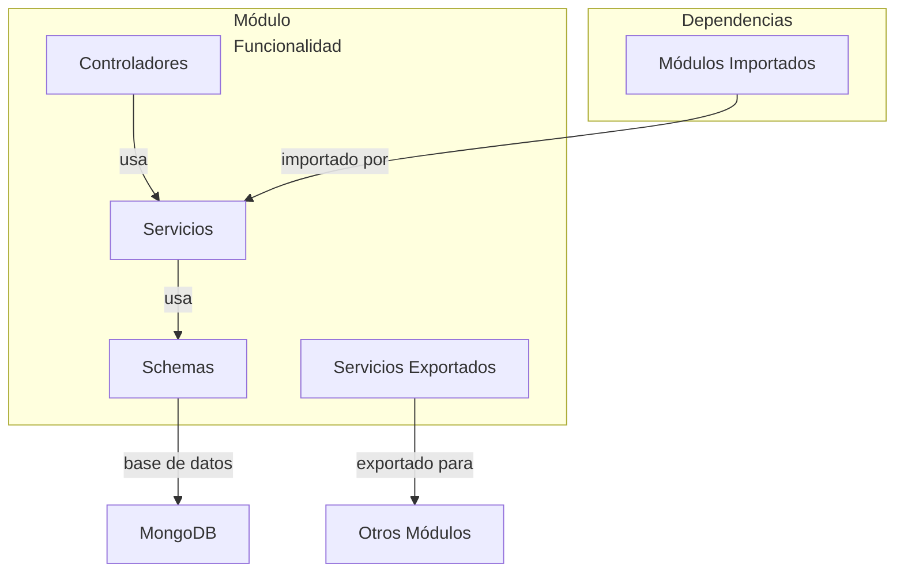
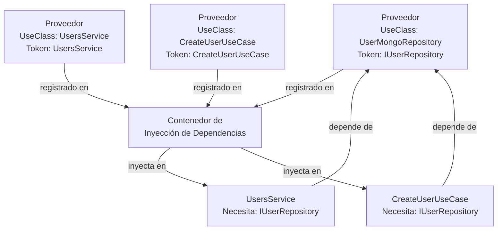
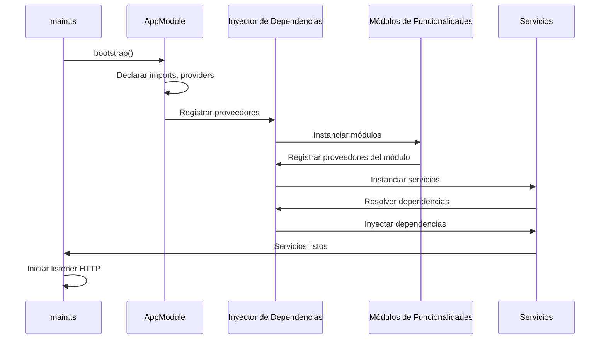

# Estructura de Módulos

## Patrón de Arquitectura de Módulos

Cada módulo NestJS encapsula una funcionalidad y declara sus dependencias explícitamente.



## Grafo de Dependencias de Módulos


## Estructura del Módulo Central

```
src/app/
├── core/                          # Infraestructura y aspectos transversales
│   ├── decorators/
│   │   ├── auth.decorator.ts     # @Auth() — marca rutas protegidas
│   │   ├── current-user.decorator.ts  # @CurrentUser() — extrae usuario
│   │   ├── has-permission.decorator.ts # @HasPermission() — metadatos de permiso
│   │   └── is-strong-password.decorator.ts
│   │
│   ├── filters/
│   │   └── global-exception.filter.ts # Manejador de excepciones
│   │
│   ├── guards/
│   │   ├── auth.guard.ts         # Verificación JWT + reflexión @Auth()
│   │   ├── permissions.guard.ts  # Aplicación de RBAC
│   │   ├── jwt-auth.guard.ts     # Legado basado en Passport (coexiste)
│   │   └── ws-auth.guard.ts      # JWT WebSocket (sin uso)
│   │
│   ├── interceptors/
│   │   └── transform.interceptor.ts # Envoltura de respuesta en envelope
│   │
│   ├── middleware/
│   │   └── i18n.middleware.ts    # Detección de idioma
│   │
│   ├── i18n/
│   │   ├── i18n.service.ts       # i18n con scope por petición
│   │   └── locales/
│   │       ├── en.json           # Traducciones en inglés
│   │       └── es.json           # Traducciones en español
│   │
│   ├── services/
│   │   ├── pagination.service.ts # Paginación genérica (sin uso)
│   │   └── query.service.ts      # Constructor de consultas (sin uso)
│   │
│   ├── utils/
│   │   ├── crypto.utils.ts
│   │   ├── file.utils.ts
│   │   ├── string.utils.ts
│   │   ├── array.utils.ts
│   │   ├── date.utils.ts
│   │   ├── validation.utils.ts
│   │   └── translation.service.ts # i18n singleton con estado
│   │
│   ├── constants/
│   │   └── constants.ts
│   │
│   ├── plugins/
│   │   └── mongoose-audit.plugin.ts # Timestamps de auditoría (sin uso)
│   │
│   └── types/
│       └── current-user.payload.ts
```

## Estructura de Módulos de Funcionalidades

### Layout Estándar de Módulo

```
src/app/modules/[feature]/
├── controllers/
│   └── [feature].controller.ts
├── services/
│   └── [feature].service.ts
├── schemas/
│   └── [feature].schema.ts
├── dtos/
│   ├── create-[feature].dto.ts
│   └── update-[feature].dto.ts
├── [feature].module.ts
└── types/ (opcional)
    └── [feature]-types.ts
```

### Módulo Users (Arquitectura Limpia)

```
src/app/modules/users/
├── controllers/
│   └── users.controller.ts
├── services/
│   └── users.service.ts          # Servicio orquestador
├── use-cases/
│   ├── create-user.use-case.ts
│   ├── find-all-users.use-case.ts
│   ├── find-user-by-id.use-case.ts
│   ├── find-user-by-username.use-case.ts
│   ├── update-user.use-case.ts
│   ├── remove-user.use-case.ts
│   └── update-language-preference.use-case.ts
├── repositories/
│   ├── user.repository.ts        # Interfaz abstracta
│   └── user.mongo.repository.ts  # Implementación con Mongoose
├── schemas/
│   └── user.schema.ts
├── dtos/
│   ├── create-user.dto.ts
│   └── update-user.dto.ts
├── types/
│   └── user-types.ts
└── users.module.ts
```

### Módulo Posts (Plano)

```
src/app/modules/posts/
├── controllers/
│   └── posts.controller.ts
├── services/
│   └── posts.service.ts
├── schemas/
│   └── post.schema.ts
├── dtos/
│   ├── create-post.dto.ts
│   └── update-post.dto.ts
└── posts.module.ts
```

### Módulo Comments (Plano + WebSocket)

```
src/app/modules/comments/
├── controllers/
│   └── comments.controller.ts
├── gateways/
│   └── comments.gateway.ts       # Gateway Socket.IO
├── services/
│   └── comments.service.ts
├── schemas/
│   └── comment.schema.ts
├── dtos/
│   ├── create-comment.dto.ts
│   └── update-comment.dto.ts
├── types/
│   └── socket-events.ts
└── comments.module.ts
```

## Declaración de Módulo

```typescript
@Module({
  imports: [
    // Módulos externos de los que depende este módulo
    MongooseModule.forFeature([{ name: 'User', schema: UserSchema }]),
    JwtModule,
  ],
  controllers: [UsersController],
  providers: [
    UsersService,
    CreateUserUseCase,
    {
      provide: 'IUserRepository',
      useClass: UserMongoRepository,
    },
  ],
  exports: [UsersService],  // Exportado para otros módulos
})
export class UsersModule {}
```

## Contenedor de Inyección de Dependencias



## Exportaciones e Importaciones de Módulos

```typescript
// Módulo A: Exporta un servicio
@Module({
  providers: [ServiceA],
  exports: [ServiceA],  // <-- exportado
})
export class ModuleA {}

// Módulo B: Importa y usa ServiceA
@Module({
  imports: [ModuleA],  // <-- importa ModuleA
  providers: [ServiceB],  // ServiceB ahora puede depender de ServiceA
})
export class ModuleB {}

// En ServiceB:
export class ServiceB {
  constructor(
    private serviceA: ServiceA,  // <-- disponible porque ModuleA lo exportó
  ) {}
}
```

## Archivos Comunes de Módulos

### DTO (Data Transfer Object)

Valida los datos de la petición entrante:

```typescript
export class CreateUserDto {
  @IsString()
  @MinLength(3)
  username: string;

  @IsEmail()
  email: string;

  @IsStrongPassword()
  password: string;

  @IsEnum(UserType)
  type: UserType;
}
```

**Archivos**: `src/app/modules/*/dtos/`

### Schema (MongoDB)

Define la estructura de los documentos:

```typescript
@Schema({ timestamps: true })
export class User {
  @Prop({ required: true, unique: true })
  username: string;

  @Prop({ required: true, unique: true })
  email: string;

  @Prop({ required: true })
  password_hash: string;

  @Prop({ enum: UserType, default: UserType.USER })
  type: UserType;

  @Prop({ type: Schema.Types.ObjectId, ref: 'Role' })
  role: Role;
}

export const UserSchema = SchemaFactory.createForClass(User);
```

**Archivos**: `src/app/modules/*/schemas/`

### Tipos

Interfaces y tipos de TypeScript:

```typescript
export type CurrentUserPayload = {
  userId: string;
  type: UserType;
  role: {
    id: string;
    permissions: Permission[];
  };
};

export enum UserType {
  USER = 'user',
  ADMIN = 'admin',
  CLIENT = 'client',
}
```

**Archivos**: `src/app/modules/*/types/`

## Inicialización del Módulo

Cuando la aplicación arranca:



---

**Siguiente**: [Módulo Auth →](../modules/auth.md)
