# Architecture Overview

## System Design

The Post-Message backend follows a **layered architecture** with partial **Clean Architecture** principles applied only to the Users module.

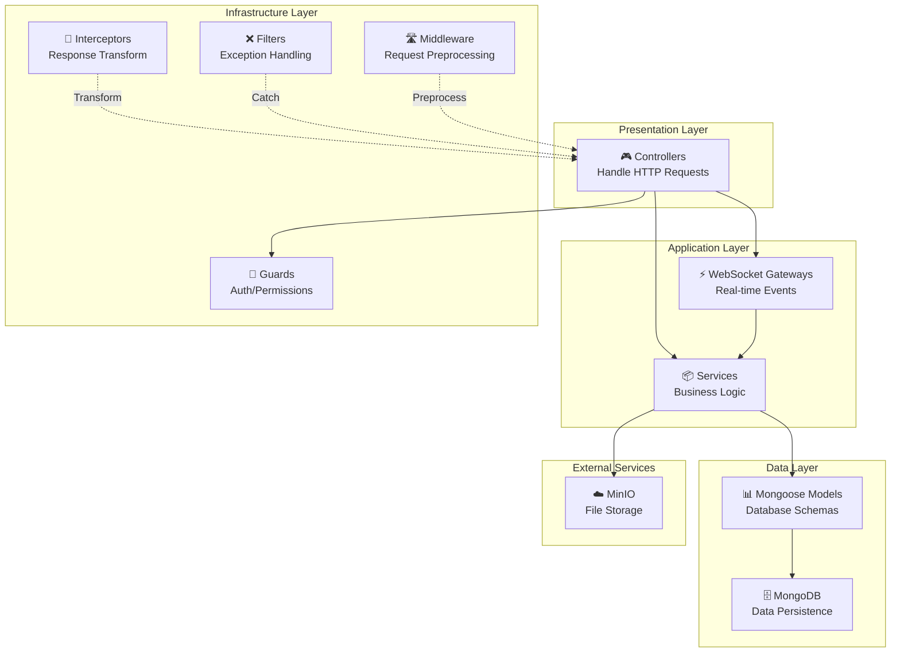

## Module Dependency Graph

## Request Flow

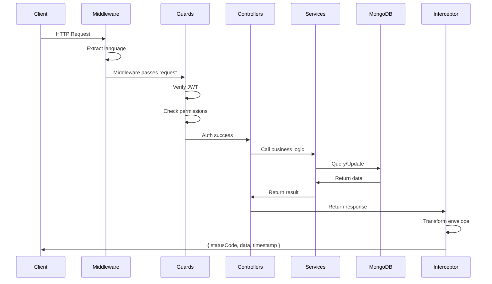

## Authentication & Authorization Flow

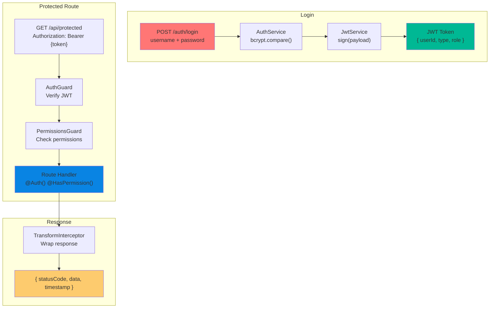

## Users Module: Clean Architecture Pattern

Only the **Users module** implements full Clean Architecture:

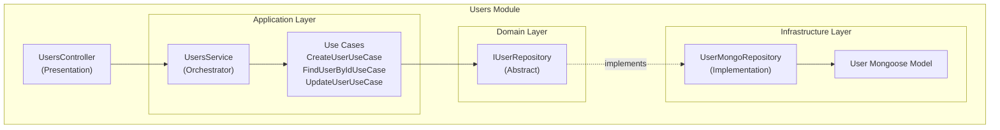

## Other Modules: Flat Pattern

All other modules bypass domain/use-case layers:

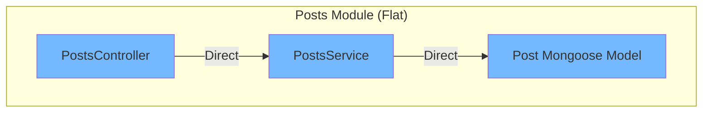

## Core Infrastructure Components

### Guards

Protects routes with authentication and authorization:

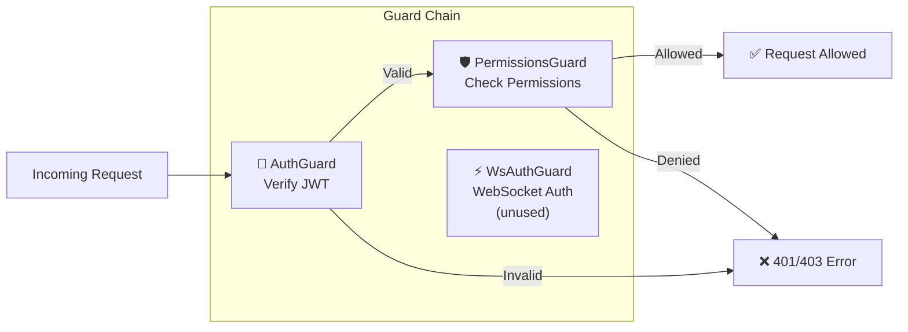

### Response Transformation

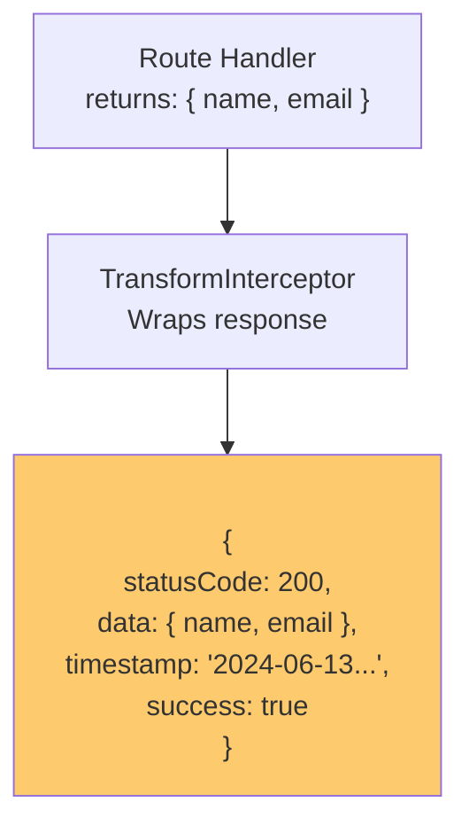

### Exception Handling

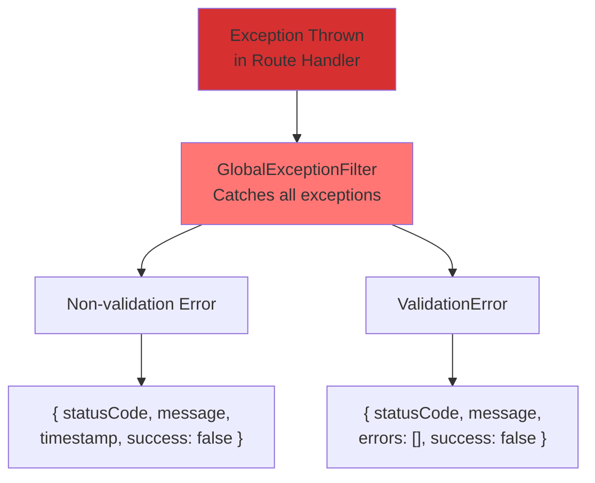

## Data Layer

### Entity Relationships

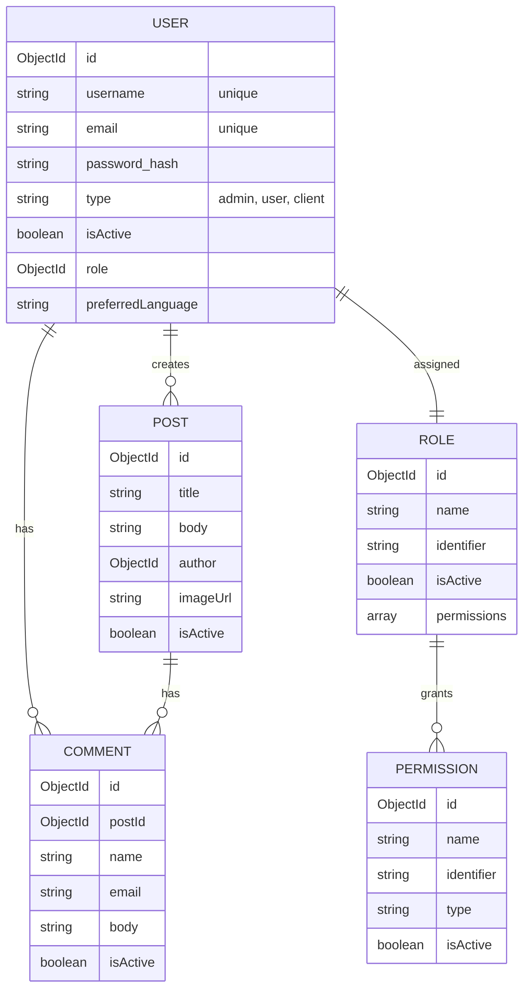

## File Storage Architecture

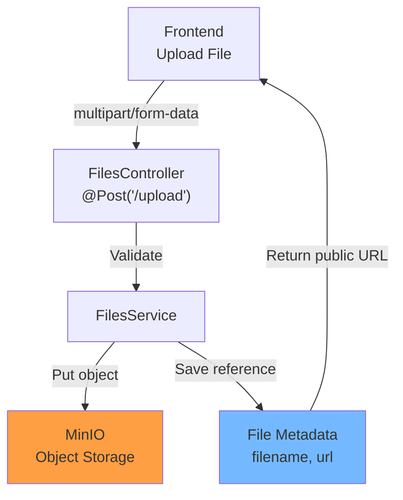

## Real-Time Communication (WebSocket)

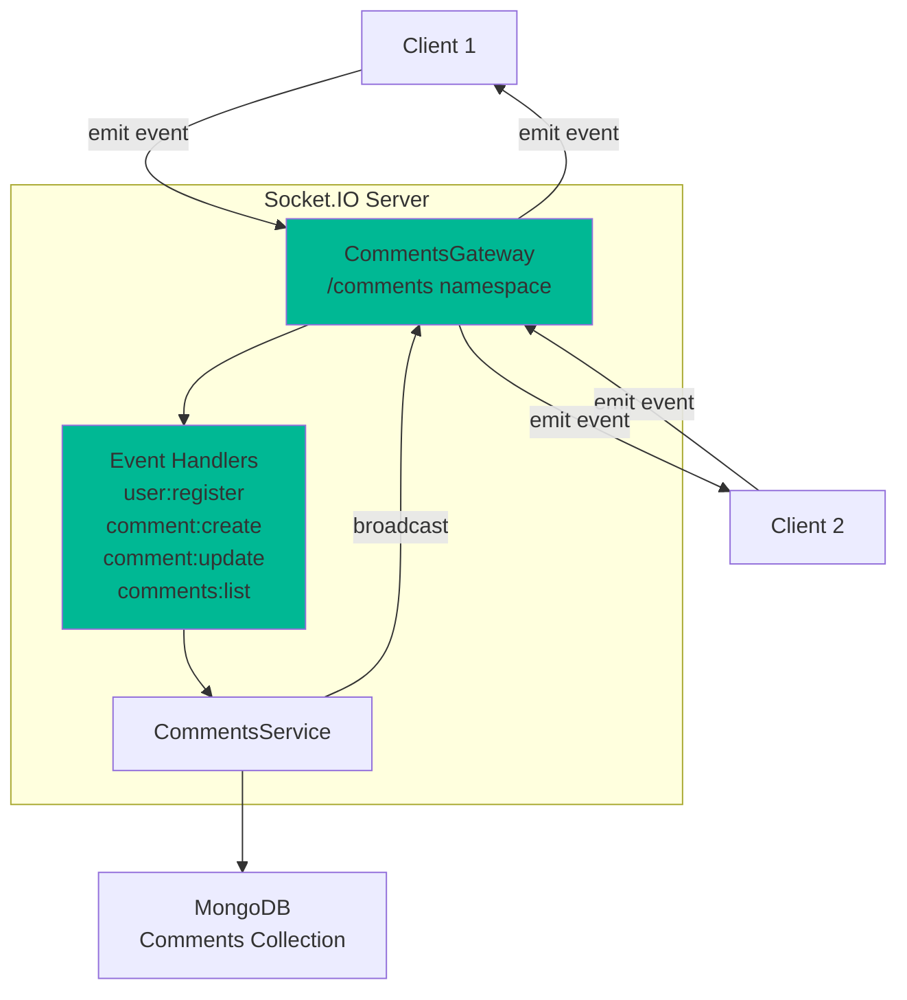

## Performance Considerations

1. **Database Indexing**: Ensure indexes on frequently queried fields
   - `users.username` (unique)
   - `users.email` (unique)
   - `roles.identifier` (unique)
   - `posts.author` (foreign key)
   - `comments.postId` (foreign key)

2. **Pagination**: Use `PaginationService` (currently unused) for large datasets

3. **Caching**: Not implemented yet; consider Redis for session storage

4. **File Storage**: MinIO provides object storage with eventual consistency

## Security Layers

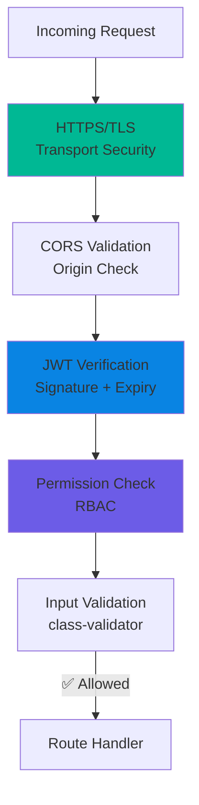

## Deployment Architecture

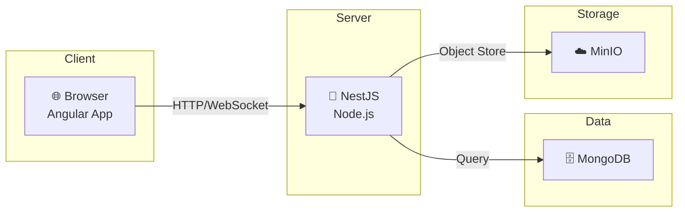

---

**Next**: [Layers →](./layers.md)
