# Descripción de la Arquitectura

## Diseño del Sistema

El backend de Post-Message sigue una **arquitectura en capas** con principios parciales de **Arquitectura Limpia** aplicados únicamente al módulo de Usuarios.

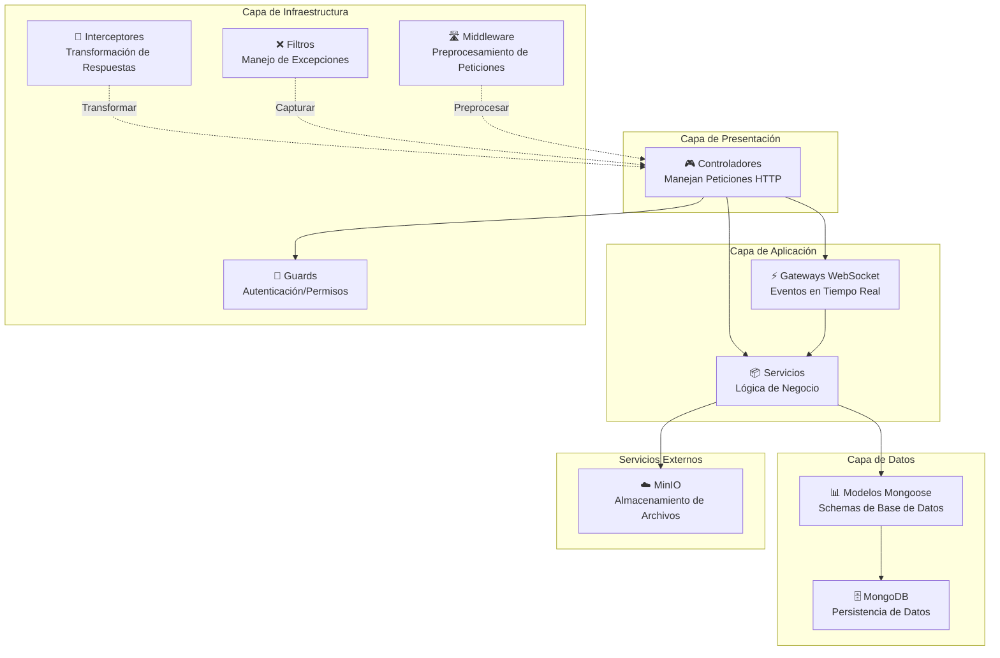

## Grafo de Dependencias de Módulos

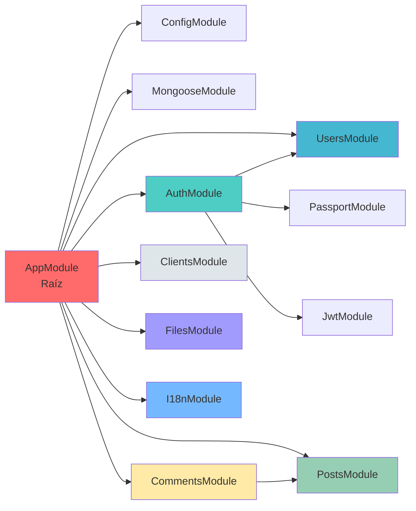

## Flujo de una Petición

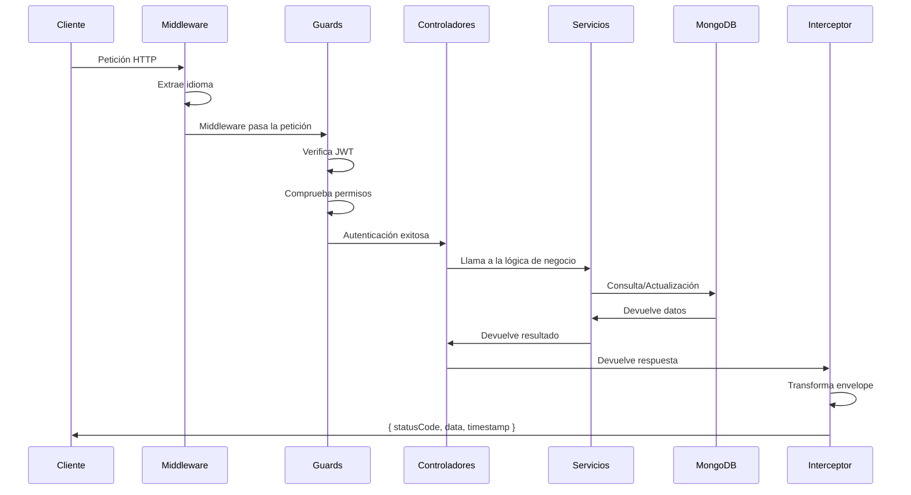

## Flujo de Autenticación y Autorización

## Módulo de Usuarios: Patrón de Arquitectura Limpia

Solo el **módulo de Usuarios** implementa la Arquitectura Limpia completa:

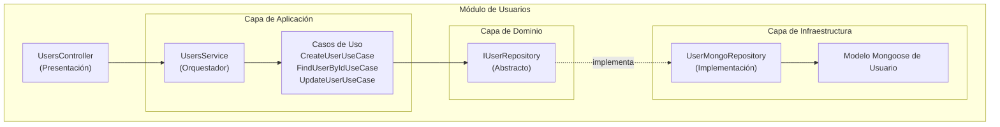

## Otros Módulos: Patrón Plano

El resto de módulos omite las capas de dominio y casos de uso:

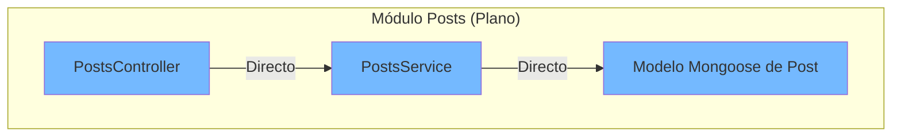

## Componentes de la Infraestructura Central

### Guards

Protege las rutas con autenticación y autorización:

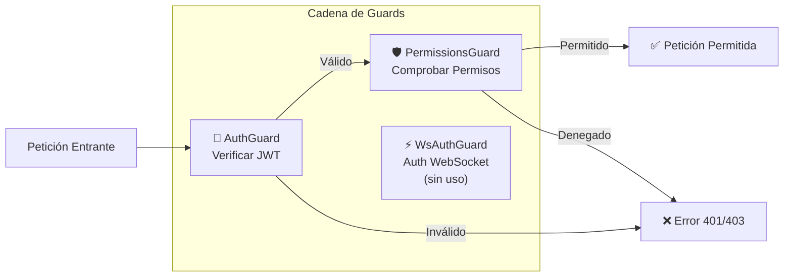

### Transformación de Respuestas

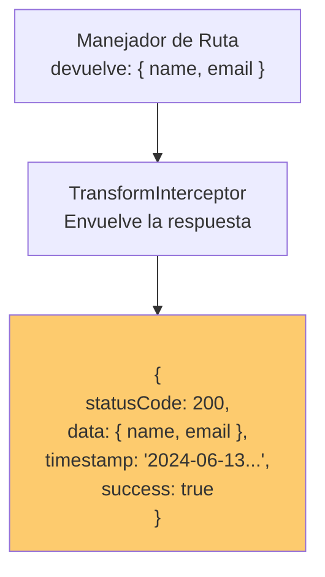

### Manejo de Excepciones

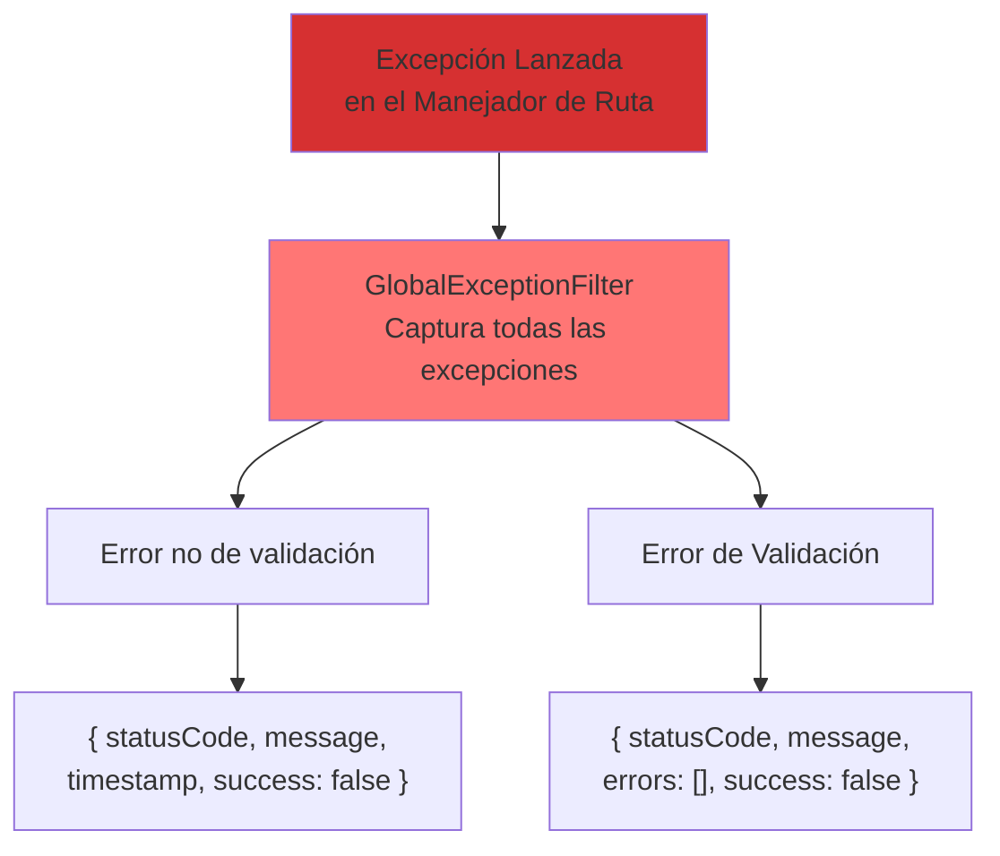

## Capa de Datos

### Relaciones entre Entidades

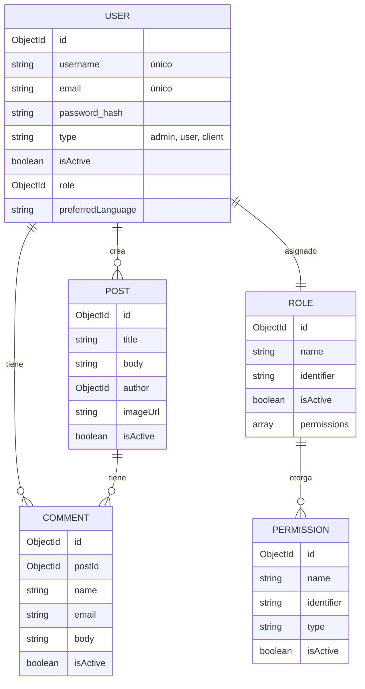

## Arquitectura de Almacenamiento de Archivos

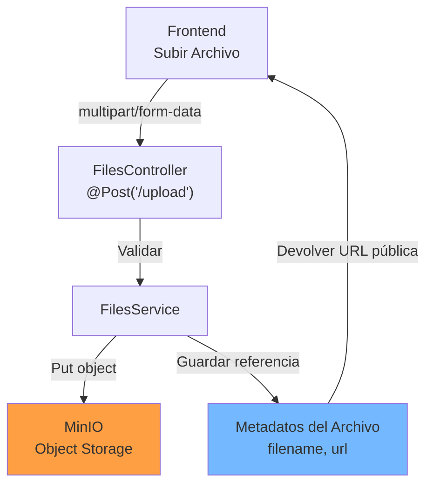

## Comunicación en Tiempo Real (WebSocket)

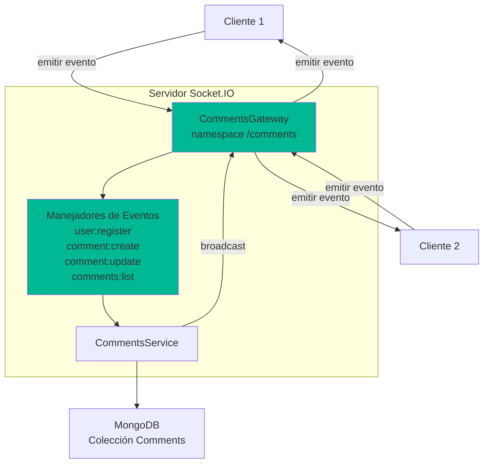

## Consideraciones de Rendimiento

1. **Indexación de Base de Datos**: Asegurar índices en campos consultados frecuentemente
   - `users.username` (único)
   - `users.email` (único)
   - `roles.identifier` (único)
   - `posts.author` (clave foránea)
   - `comments.postId` (clave foránea)

2. **Paginación**: Usar `PaginationService` (actualmente sin uso) para conjuntos de datos grandes

3. **Caché**: Aún no implementado; considerar Redis para almacenamiento de sesiones

4. **Almacenamiento de Archivos**: MinIO provee object storage con consistencia eventual

## Capas de Seguridad

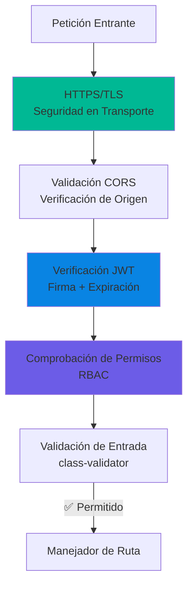

## Arquitectura de Despliegue

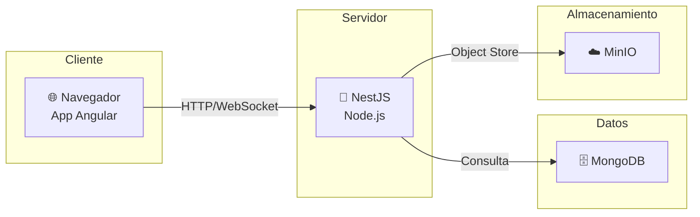

---

**Siguiente**: [Capas →](./layers.md)
