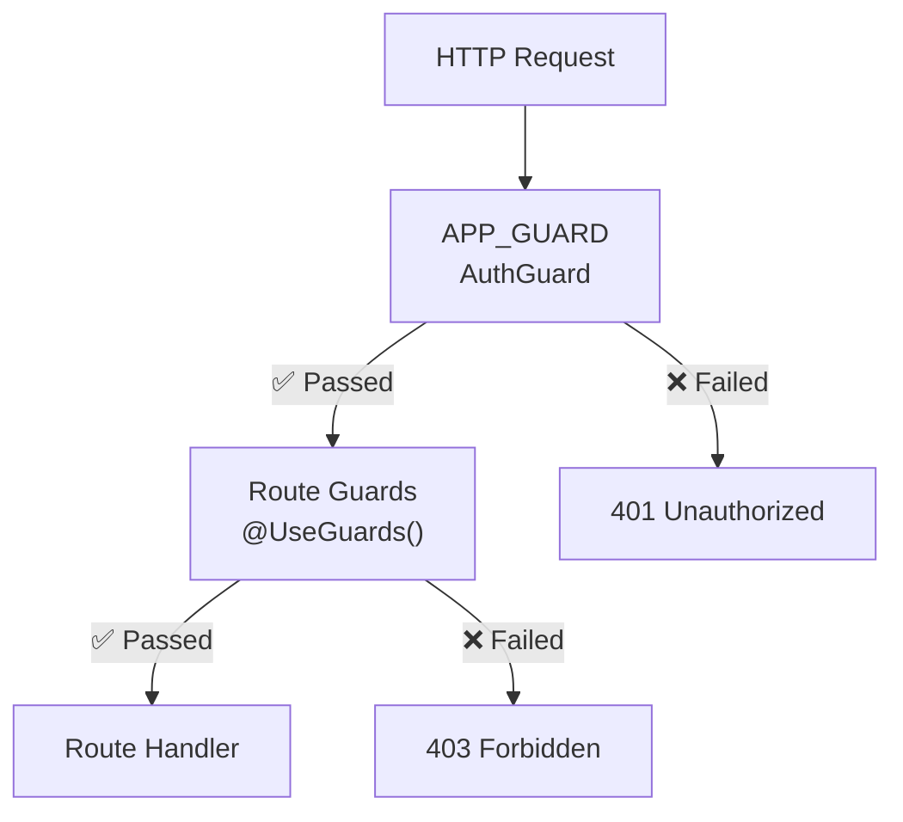

# Guards 🔐

Guards protect routes by verifying authentication and authorization before allowing access.

## AuthGuard (Core)

The main authentication guard for the application.

```typescript
@Injectable()
export class AuthGuard implements CanActivate {
  constructor(
    private jwtService: JwtService,
    private translationService: TranslationService,
  ) {}

  canActivate(context: ExecutionContext): boolean {
    const request = context.switchToHttp().getRequest();
    const auth = request.headers.authorization;

    if (!auth) {
      throw new UnauthorizedException(
        this.translationService.translate('auth.required'),
      );
    }

    const token = auth.replace('Bearer ', '');

    try {
      const payload = this.jwtService.verify(token);
      request.user = payload;
      
      // Check @Auth() decorator for required roles
      const requiredRoles = Reflect.getMetadata(AUTH_KEY, context.getHandler());
      if (requiredRoles && !requiredRoles.includes(payload.type)) {
        throw new ForbiddenException('Insufficient permissions');
      }

      return true;
    } catch (error) {
      throw new UnauthorizedException('Invalid token');
    }
  }
}
```

**Location**: `src/app/core/guards/auth.guard.ts`

**Global Registration**:
```typescript
@Module({
  providers: [
    {
      provide: APP_GUARD,
      useClass: AuthGuard,
    },
  ],
})
export class AppModule {}
```

## PermissionsGuard

Enforces role-based permission checks:

```typescript
@Injectable()
export class PermissionsGuard implements CanActivate {
  constructor(private reflector: Reflector) {}

  canActivate(context: ExecutionContext): boolean {
    const requiredPermission = this.reflector.get<string>(
      PERMISSION_KEY,
      context.getHandler(),
    );

    if (!requiredPermission) {
      return true;
    }

    const request = context.switchToHttp().getRequest();
    const user = request.user;

    if (!user.role || !user.role.permissions) {
      throw new ForbiddenException('No permissions');
    }

    const hasPermission = user.role.permissions.some(
      (p) => p.identifier === requiredPermission,
    );

    if (!hasPermission) {
      throw new ForbiddenException('Permission denied');
    }

    return true;
  }
}
```

**Location**: `src/app/core/guards/permissions.guard.ts`

## WsAuthGuard (WebSocket)

Verifies JWT tokens for WebSocket connections.

```typescript
@Injectable()
export class WsAuthGuard implements CanActivate {
  constructor(private jwtService: JwtService) {}

  canActivate(context: ExecutionContext): boolean {
    const wsContext = context.switchToWs();
    const client = wsContext.getClient();
    
    const token = client.handshake.auth.token;

    if (!token) {
      return false;
    }

    try {
      const payload = this.jwtService.verify(token);
      client.handshake.user = payload;
      return true;
    } catch (error) {
      return false;
    }
  }
}
```

**Location**: `src/app/core/guards/ws-auth.guard.ts`

⚠️ **Currently unused** — CommentsGateway doesn't apply this guard.

## JwtAuthGuard (Legacy)

Passport-based JWT guard (coexists with core AuthGuard):

```typescript
@Injectable()
export class JwtAuthGuard extends AuthGuard('jwt') {
  canActivate(context: ExecutionContext): Promise<boolean> {
    return super.canActivate(context) as Promise<boolean>;
  }
}
```

**Location**: `src/app/modules/auth/guards/jwt-auth.guard.ts`

⚠️ **Deprecated** — Use core AuthGuard with @Auth() instead

## Using Guards

### With @Auth() Decorator

```typescript
@Controller('users')
export class UsersController {
  @Get('profile')
  @Auth()  // Protected - requires any authenticated user
  getProfile(@CurrentUser() user: CurrentUserPayload) {
    return user;
  }

  @Get('admin')
  @Auth({ roles: ['admin'] })  // Protected - admin only
  getAdmin() {
    return { admin: true };
  }

  @Get('public')
  // No @Auth() - publicly accessible
  getPublic() {
    return { message: 'Public' };
  }
}
```

### With @HasPermission() Decorator

```typescript
@Controller('posts')
export class PostsController {
  @Delete(':id')
  @Auth()
  @HasPermission('posts:delete')  // Check permission
  deletePost(@Param('id') id: string) {
    return this.postsService.deletePost(id);
  }
}
```

## Guard Execution Order



## Example: Protected Endpoint

```typescript
// Request
GET /users/123
Authorization: Bearer eyJhbGc...

// AuthGuard Processing
1. Extract token from header ✅
2. Verify JWT signature ✅
3. Check @Auth() metadata ✅
4. Attach user to request ✅
5. Pass to handler

// Response
{
  "statusCode": 200,
  "data": { "id": "123", "username": "john" },
  "success": true
}
```

## Error Responses

```json
{
  "statusCode": 401,
  "message": "Invalid token",
  "timestamp": "2024-06-13T12:34:56.789Z",
  "success": false
}
```

```json
{
  "statusCode": 403,
  "message": "Permission denied",
  "timestamp": "2024-06-13T12:34:56.789Z",
  "success": false
}
```

---

**Next**: [Interceptors →](./interceptors.md)
