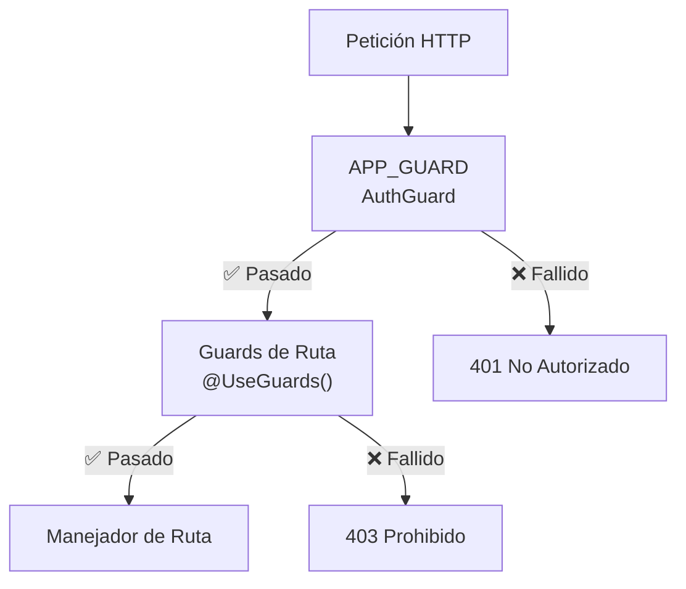

# Guards 🔐

Los guards protegen las rutas verificando la autenticación y autorización antes de permitir el acceso.

## AuthGuard (Principal)

El guard de autenticación principal de la aplicación.

```typescript
@Injectable()
export class AuthGuard implements CanActivate {
  constructor(
    private jwtService: JwtService,
    private translationService: TranslationService,
  ) {}

  canActivate(context: ExecutionContext): boolean {
    const request = context.switchToHttp().getRequest();
    const auth = request.headers.authorization;

    if (!auth) {
      throw new UnauthorizedException(
        this.translationService.translate('auth.required'),
      );
    }

    const token = auth.replace('Bearer ', '');

    try {
      const payload = this.jwtService.verify(token);
      request.user = payload;
      
      // Comprobar el decorador @Auth() para roles requeridos
      const requiredRoles = Reflect.getMetadata(AUTH_KEY, context.getHandler());
      if (requiredRoles && !requiredRoles.includes(payload.type)) {
        throw new ForbiddenException('Insufficient permissions');
      }

      return true;
    } catch (error) {
      throw new UnauthorizedException('Invalid token');
    }
  }
}
```

**Ubicación**: `src/app/core/guards/auth.guard.ts`

**Registro Global**:
```typescript
@Module({
  providers: [
    {
      provide: APP_GUARD,
      useClass: AuthGuard,
    },
  ],
})
export class AppModule {}
```

## PermissionsGuard

Aplica comprobaciones de permisos basadas en roles:

```typescript
@Injectable()
export class PermissionsGuard implements CanActivate {
  constructor(private reflector: Reflector) {}

  canActivate(context: ExecutionContext): boolean {
    const requiredPermission = this.reflector.get<string>(
      PERMISSION_KEY,
      context.getHandler(),
    );

    if (!requiredPermission) {
      return true;
    }

    const request = context.switchToHttp().getRequest();
    const user = request.user;

    if (!user.role || !user.role.permissions) {
      throw new ForbiddenException('No permissions');
    }

    const hasPermission = user.role.permissions.some(
      (p) => p.identifier === requiredPermission,
    );

    if (!hasPermission) {
      throw new ForbiddenException('Permission denied');
    }

    return true;
  }
}
```

**Ubicación**: `src/app/core/guards/permissions.guard.ts`

## WsAuthGuard (WebSocket)

Verifica tokens JWT para conexiones WebSocket.

```typescript
@Injectable()
export class WsAuthGuard implements CanActivate {
  constructor(private jwtService: JwtService) {}

  canActivate(context: ExecutionContext): boolean {
    const wsContext = context.switchToWs();
    const client = wsContext.getClient();
    
    const token = client.handshake.auth.token;

    if (!token) {
      return false;
    }

    try {
      const payload = this.jwtService.verify(token);
      client.handshake.user = payload;
      return true;
    } catch (error) {
      return false;
    }
  }
}
```

**Ubicación**: `src/app/core/guards/ws-auth.guard.ts`

⚠️ **Actualmente sin uso** — CommentsGateway no aplica este guard.

## JwtAuthGuard (Legado)

Guard JWT basado en Passport (coexiste con el AuthGuard principal):

```typescript
@Injectable()
export class JwtAuthGuard extends AuthGuard('jwt') {
  canActivate(context: ExecutionContext): Promise<boolean> {
    return super.canActivate(context) as Promise<boolean>;
  }
}
```

**Ubicación**: `src/app/modules/auth/guards/jwt-auth.guard.ts`

⚠️ **Deprecado** — Usar el AuthGuard principal con @Auth() en su lugar

## Uso de Guards

### Con el Decorador @Auth()

```typescript
@Controller('users')
export class UsersController {
  @Get('profile')
  @Auth()  // Protegido - requiere cualquier usuario autenticado
  getProfile(@CurrentUser() user: CurrentUserPayload) {
    return user;
  }

  @Get('admin')
  @Auth({ roles: ['admin'] })  // Protegido - solo admin
  getAdmin() {
    return { admin: true };
  }

  @Get('public')
  // Sin @Auth() - acceso público
  getPublic() {
    return { message: 'Public' };
  }
}
```

### Con el Decorador @HasPermission()

```typescript
@Controller('posts')
export class PostsController {
  @Delete(':id')
  @Auth()
  @HasPermission('posts:delete')  // Comprobar permiso
  deletePost(@Param('id') id: string) {
    return this.postsService.deletePost(id);
  }
}
```

## Orden de Ejecución de Guards



## Ejemplo: Endpoint Protegido

```typescript
// Petición
GET /users/123
Authorization: Bearer eyJhbGc...

// Procesamiento de AuthGuard
1. Extraer token del header ✅
2. Verificar firma JWT ✅
3. Comprobar metadatos @Auth() ✅
4. Adjuntar usuario a la petición ✅
5. Pasar al manejador

// Respuesta
{
  "statusCode": 200,
  "data": { "id": "123", "username": "john" },
  "success": true
}
```

## Respuestas de Error

```json
{
  "statusCode": 401,
  "message": "Invalid token",
  "timestamp": "2024-06-13T12:34:56.789Z",
  "success": false
}
```

```json
{
  "statusCode": 403,
  "message": "Permission denied",
  "timestamp": "2024-06-13T12:34:56.789Z",
  "success": false
}
```

---

**Siguiente**: [Interceptores →](./interceptors.md)
