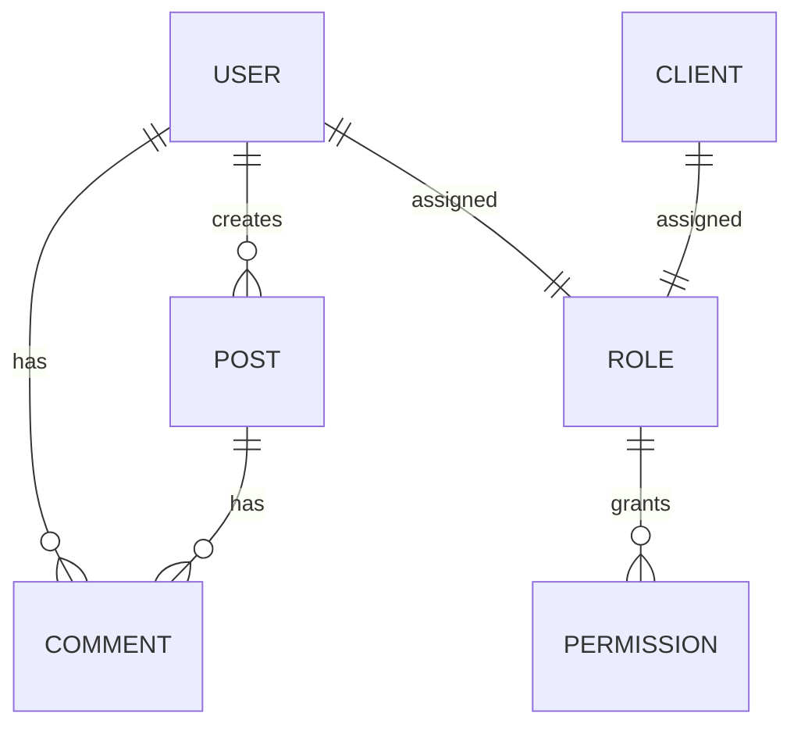

# Database Schemas 📊

All data structures are defined using Mongoose schemas.

## User Schema

```typescript
@Schema({ timestamps: true })
export class User {
  @Prop({ required: true, unique: true })
  username: string;

  @Prop({ required: true, unique: true })
  email: string;

  @Prop({ required: true })
  password_hash: string;

  @Prop({ required: true })
  name: string;

  @Prop({ required: true })
  lastname: string;

  @Prop({ enum: ['user', 'admin', 'client'], default: 'user' })
  type: string;

  @Prop({ type: Schema.Types.ObjectId, ref: 'Role' })
  role: Role;

  @Prop({ default: true })
  isActive: boolean;

  @Prop({ default: false })
  isDeleted: boolean;

  @Prop({ enum: ['en', 'es'], default: 'en' })
  preferredLanguage: string;

  createdAt?: Date;
  updatedAt?: Date;
}
```

**Collection**: `users`

## Post Schema

```typescript
@Schema({ timestamps: true })
export class Post {
  @Prop({ required: true })
  title: string;

  @Prop({ required: true })
  body: string;

  @Prop({ type: Schema.Types.ObjectId, ref: 'User' })
  author: User;

  @Prop()
  imageUrl?: string;

  @Prop()
  imageFilename?: string;

  @Prop({ default: true })
  isActive: boolean;

  @Prop({ default: false })
  isDeleted: boolean;

  createdAt?: Date;
  updatedAt?: Date;
}
```

**Collection**: `posts`

## Comment Schema

```typescript
@Schema({ timestamps: true })
export class Comment {
  @Prop({ type: Schema.Types.ObjectId, ref: 'Post', required: true })
  postId: Post;

  @Prop({ required: true })
  name: string;

  @Prop({ required: true })
  email: string;

  @Prop({ required: true })
  body: string;

  @Prop({ default: true })
  isActive: boolean;

  @Prop({ default: false })
  isDeleted: boolean;

  createdAt?: Date;
  updatedAt?: Date;
}
```

**Collection**: `comments`

## Role Schema

```typescript
@Schema({ timestamps: true })
export class Role {
  @Prop({ required: true, unique: true })
  name: string;

  @Prop({ required: true, unique: true })
  identifier: string;

  @Prop({ type: [Schema.Types.ObjectId], ref: 'Permission', default: [] })
  permissions: Permission[];

  @Prop({ default: true })
  isActive: boolean;

  @Prop({ default: false })
  isDeleted: boolean;

  createdAt?: Date;
  updatedAt?: Date;
}
```

**Collection**: `roles`

## Permission Schema

```typescript
@Schema({ timestamps: true })
export class Permission {
  @Prop({ required: true })
  name: string;

  @Prop({ required: true, unique: true })
  identifier: string;

  @Prop({
    enum: ['user', 'roles', 'permissions', 'comments', 'clients', 'statistics', 'audits'],
  })
  type: string;

  @Prop({ default: true })
  isActive: boolean;

  @Prop({ default: false })
  isDeleted: boolean;

  createdAt?: Date;
  updatedAt?: Date;
}
```

**Collection**: `permissions`

## Client Schema

```typescript
@Schema({ timestamps: true })
export class Client {
  @Prop({ required: true, unique: true })
  username: string;

  @Prop({ required: true, unique: true })
  email: string;

  @Prop()
  password?: string;

  @Prop({ required: true })
  name: string;

  @Prop({ required: true })
  lastname: string;

  @Prop({ enum: ['user', 'admin', 'client'], default: 'client' })
  type: string;

  @Prop({ type: Schema.Types.ObjectId, ref: 'Role' })
  role: Role;

  @Prop({ default: true })
  isActive: boolean;

  @Prop({ default: false })
  isDeleted: boolean;

  createdAt?: Date;
  updatedAt?: Date;
}
```

**Collection**: `clients`

## ER Diagram



---

**Next**: [Relationships →](./relationships.md)
