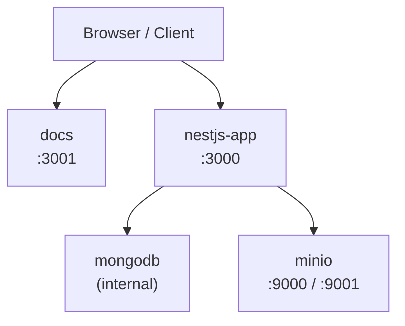

# Docker Deployment

## Stack Overview



All services share a single bridge network (`app-network`). MongoDB is **not exposed** outside that network.

---

## Dockerfile Walkthrough

The backend uses a **two-stage build** at `backend-post-message-nestjs/Dockerfile`.

### Stage 1 — Builder

```dockerfile
FROM node:22-alpine AS builder
WORKDIR /app
COPY package*.json ./
RUN npm ci
COPY . .
RUN npm run build
```

- Base image: `node:22-alpine` (minimal footprint)
- `npm ci` ensures a clean, reproducible install from `package-lock.json`
- `npm run build` compiles TypeScript to `dist/`

### Stage 2 — Runtime

```dockerfile
FROM node:22-alpine
RUN apk add --no-cache dumb-init
RUN addgroup -g 1001 nestjs && adduser -u 1001 -G nestjs -s /bin/sh -D nestjs
WORKDIR /app
COPY --from=builder /app/node_modules ./node_modules
COPY --from=builder /app/dist ./dist
COPY --from=builder /app/src ./src
COPY --from=builder /app/package*.json ./
COPY --from=builder /app/tsconfig*.json ./
USER nestjs
EXPOSE 3000
CMD ["dumb-init", "node", "dist/main.js"]
```

Key decisions:
- **dumb-init** as PID 1 — proper signal forwarding and zombie process reaping
- **Non-root user** `nestjs` (uid/gid 1001) — principle of least privilege
- Only the compiled `dist/` and runtime dependencies are in the final image

---

## docker-compose Services

### mongodb

```yaml
image: mongo:latest
container_name: mi_mongo
networks: [app-network]
volumes: [mongo_data:/data/db]
# No ports exposed — internal only
healthcheck:
  test: mongosh --eval "db.runCommand({ ping: 1 })"
```

MongoDB is **internal only**. It is reachable from other services as `mongodb:27017` but is not accessible from the host machine.

### minio

```yaml
image: minio/minio:latest
container_name: mi_minio
ports:
  - "9000:9000"   # S3 API
  - "9001:9001"   # Web console
command: server /data --console-address ":9001"
volumes: [minio_data:/data]
healthcheck:
  test: curl -f http://localhost:9000/minio/health/live
```

- S3-compatible API on port 9000
- Web console at `http://localhost:9001`

### nestjs-app

```yaml
build: ./backend-post-message-nestjs
container_name: mi_nestjs
ports:
  - "3000:3000"
depends_on: [mongodb, minio]
healthcheck:
  test: node -e "require('http').get('http://localhost:3000/api/health')"
```

Waits for MongoDB and MinIO to be healthy before starting.

### docs

```yaml
build: ./docs-post-message
ports:
  - "3001:3001"
```

Docusaurus documentation site.

---

## Required Root `.env` File

Docker Compose substitutes variables from a `.env` file in the **repository root** (not inside the backend folder). Create it before running:

```dotenv
# MongoDB
MONGO_ROOT_USER=root
MONGO_ROOT_PASSWORD=changeme
MONGO_DB_NAME=postmessage

# MinIO credentials
MINIO_ROOT_USER=minioadmin
MINIO_ROOT_PASSWORD=minioadmin
MINIO_ENDPOINT=minio
MINIO_ACCESS_KEY=minioadmin
MINIO_SECRET_KEY=minioadmin
MINIO_BUCKET_NAME=posts
```

> These values are injected into the `nestjs-app` environment at runtime. The backend container itself uses `MONGODB_URI`, `MINIO_ENDPOINT`, etc., which Docker Compose constructs from the above.

---

## Build and Run

```bash
# Start all services (uses cached images)
docker compose up -d

# Rebuild images then start
docker compose up -d --build

# Stop all services
docker compose down

# Stop and remove volumes (WARNING: deletes all data)
docker compose down -v
```

---

## Logs

```bash
# Stream logs from the NestJS app
docker compose logs -f nestjs-app

# Stream logs from all services
docker compose logs -f

# Last 100 lines from MongoDB
docker compose logs --tail=100 mongodb
```

---

## Health Checks

Each service declares a health check. Docker Compose uses these to sequence startup via `depends_on: condition: service_healthy`.

| Service | Health Check | Endpoint |
|---|---|---|
| mongodb | `mongosh --eval "db.runCommand({ ping: 1 })"` | Internal |
| minio | `curl -f http://localhost:9000/minio/health/live` | Internal |
| nestjs-app | `node -e require('http').get(...)` | `/api/health` |

---

## Persistent Volumes

| Volume | Service | Purpose |
|---|---|---|
| `mongo_data` | mongodb | Database files — survives `docker compose down` |
| `minio_data` | minio | Uploaded files — survives `docker compose down` |

Both volumes are managed by Docker (named volumes). They are **not** deleted by `docker compose down` unless you add the `-v` flag.

---

## Network

All services communicate over `app-network` (bridge driver). The MongoDB container does not publish any ports to the host — it is only reachable as `mongodb` within `app-network`.

| Service | Internal hostname | Host port |
|---|---|---|
| mongodb | `mongodb` | — |
| minio | `minio` | 9000, 9001 |
| nestjs-app | `nestjs-app` | 3000 |
| docs | `docs` | 3001 |
