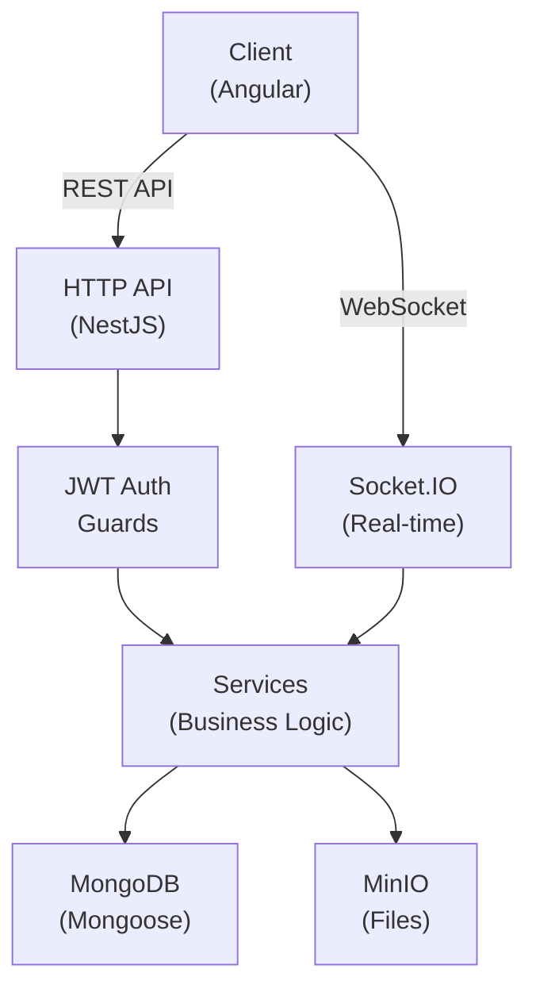

# 🚀 Backend Overview

Welcome to the Post-Message backend documentation. This guide covers the NestJS application architecture, modules, services, utilities, and configuration.

## Quick Start

The backend is a **NestJS 11** application with the following stack:

- **Framework**: NestJS 11
- **Database**: MongoDB (Mongoose ODM)
- **Real-Time**: Socket.IO for live comments
- **File Storage**: MinIO object storage
- **Authentication**: JWT tokens
- **Internationalization**: i18n (English/Spanish)

## Project Structure

```
backend-post-message-nestjs/
├── src/
│   └── app/
│       ├── core/                    # Core infrastructure
│       │   ├── guards/             # Auth, permissions, WebSocket guards
│       │   ├── interceptors/       # Response transformation
│       │   ├── filters/            # Exception handling
│       │   ├── decorators/         # Custom @Auth, @CurrentUser, etc.
│       │   ├── middleware/         # i18n language detection
│       │   ├── services/           # Generic utilities (pagination, queries)
│       │   ├── utils/              # Helpers (crypto, files, strings)
│       │   ├── i18n/               # Internationalization
│       │   ├── plugins/            # Mongoose plugins (audit)
│       │   └── constants/          # App-wide constants
│       │
│       └── modules/                 # Feature modules
│           ├── auth/               # Authentication
│           ├── users/              # User management (Clean Architecture)
│           ├── posts/              # Post CRUD
│           ├── comments/           # Comments + WebSocket gateway
│           ├── clients/            # Client management
│           ├── files/              # File upload/storage
│           ├── roles/              # Role management
│           ├── permissions/        # Permission management
│           └── i18n/               # Translation endpoints
│
├── config/
│   └── env/
│       ├── default.ts             # Default env variables
│       └── production.ts          # Production overrides
│
├── main.ts                         # Application entry point
└── app.module.ts                   # Root module
```

## Architecture Overview



## Core Concepts

### 1. **Authentication & Authorization**
- JWT-based authentication
- Role-based access control (RBAC)
- Permission system with granular control
- `@Auth()` decorator for route protection

### 2. **Layer Architecture**
- **Controllers**: Handle HTTP requests/responses
- **Services**: Contain business logic
- **Models/Schemas**: MongoDB data structures
- **Guards**: Protect routes with auth/permissions
- **Filters**: Global exception handling
- **Interceptors**: Transform responses

### 3. **Real-Time Features**
- Socket.IO gateway for live comments
- Event-driven architecture
- User presence tracking

### 4. **File Management**
- MinIO for object storage
- UUID-based file naming
- Public URL generation

### 5. **Internationalization**
- Dual i18n systems (Singleton + Request-scoped)
- Support for English and Spanish
- Language detection from `Accept-Language` header

## Key Modules

| Module | Purpose | Pattern |
|--------|---------|---------|
| **Auth** | JWT login/validation | Standard NestJS |
| **Users** | User management | Clean Architecture (Domain + UseCases) |
| **Posts** | CRUD posts with images | Flat Service pattern |
| **Comments** | CRUD comments + WebSocket | Flat Service + Gateway |
| **Clients** | Client management | Flat Service pattern |
| **Files** | MinIO file operations | Flat Service pattern |
| **Roles** | Role CRUD | Flat Service pattern |
| **Permissions** | Permission CRUD | Flat Service pattern |
| **I18n** | Translation endpoints | Service + Controller |

## API Response Format

All responses follow a consistent envelope:

```json
{
  "statusCode": 200,
  "data": { /* ... */ },
  "timestamp": "2024-06-13T12:34:56.789Z",
  "success": true
}
```

Errors:

```json
{
  "statusCode": 400,
  "message": "Validation failed",
  "errors": [ /* validation errors */ ],
  "timestamp": "2024-06-13T12:34:56.789Z",
  "path": "/api/endpoint",
  "success": false
}
```

## Database

- **Type**: MongoDB
- **ODM**: Mongoose
- **Collections**: users, posts, comments, clients, roles, permissions
- **Relationships**: Role references, Post/Comment references

See [Schemas Documentation](../database/schemas.md) for detailed structure.

## Getting Started

1. [Environment Setup](../config/setup.md)
2. [Architecture Overview](./architecture/overview.md)
3. [Module Breakdown](./modules/auth.md)
4. [Explore Core Features](./core/guards.md)

---

**Next**: [Architecture Overview →](./architecture/overview.md)
