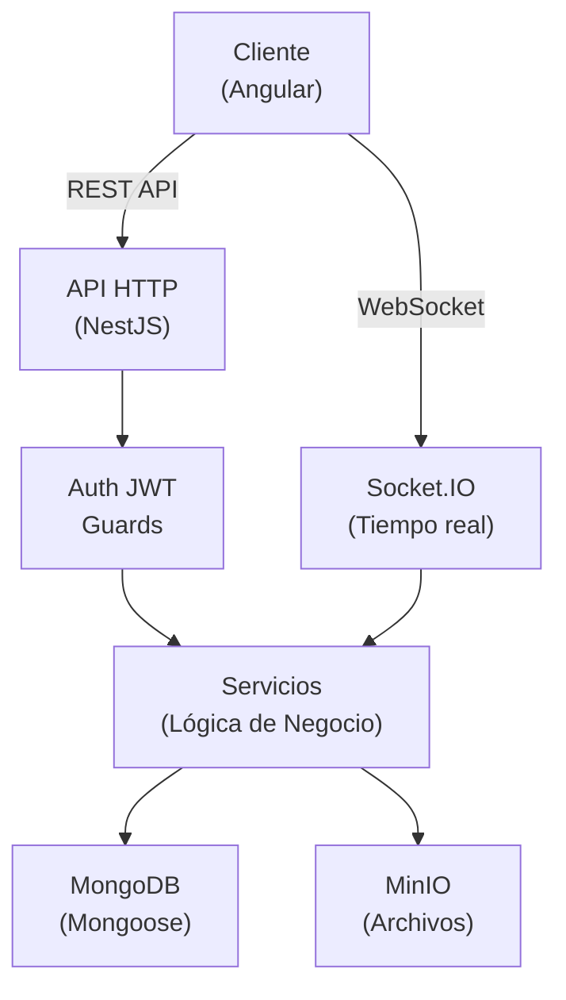

# 🚀 Descripción General del Backend

Bienvenido a la documentación del backend de Post-Message. Esta guía cubre la arquitectura de la aplicación NestJS, módulos, servicios, utilidades y configuración.

## Inicio Rápido

El backend es una aplicación **NestJS 11** con el siguiente stack:

- **Framework**: NestJS 11
- **Base de datos**: MongoDB (Mongoose ODM)
- **Tiempo real**: Socket.IO para comentarios en vivo
- **Almacenamiento de archivos**: MinIO object storage
- **Autenticación**: Tokens JWT
- **Internacionalización**: i18n (Inglés/Español)

## Estructura del Proyecto

```
backend-post-message-nestjs/
├── src/
│   └── app/
│       ├── core/                    # Infraestructura central
│       │   ├── guards/             # Guards de autenticación, permisos y WebSocket
│       │   ├── interceptors/       # Transformación de respuestas
│       │   ├── filters/            # Manejo de excepciones
│       │   ├── decorators/         # @Auth, @CurrentUser, etc. personalizados
│       │   ├── middleware/         # Detección de idioma i18n
│       │   ├── services/           # Utilidades genéricas (paginación, consultas)
│       │   ├── utils/              # Helpers (crypto, archivos, strings)
│       │   ├── i18n/               # Internacionalización
│       │   ├── plugins/            # Plugins de Mongoose (auditoría)
│       │   └── constants/          # Constantes de la aplicación
│       │
│       └── modules/                 # Módulos de funcionalidades
│           ├── auth/               # Autenticación
│           ├── users/              # Gestión de usuarios (Arquitectura Limpia)
│           ├── posts/              # CRUD de posts
│           ├── comments/           # Comentarios + gateway WebSocket
│           ├── clients/            # Gestión de clientes
│           ├── files/              # Subida/almacenamiento de archivos
│           ├── roles/              # Gestión de roles
│           ├── permissions/        # Gestión de permisos
│           └── i18n/               # Endpoints de traducción
│
├── config/
│   └── env/
│       ├── default.ts             # Variables de entorno por defecto
│       └── production.ts          # Overrides de producción
│
├── main.ts                         # Punto de entrada de la aplicación
└── app.module.ts                   # Módulo raíz
```

## Descripción de la Arquitectura



## Conceptos Clave

### 1. **Autenticación y Autorización**
- Autenticación basada en JWT
- Control de acceso basado en roles (RBAC)
- Sistema de permisos con control granular
- Decorador `@Auth()` para proteger rutas

### 2. **Arquitectura en Capas**
- **Controladores**: Manejan peticiones/respuestas HTTP
- **Servicios**: Contienen la lógica de negocio
- **Modelos/Schemas**: Estructuras de datos en MongoDB
- **Guards**: Protegen rutas con autenticación/permisos
- **Filtros**: Manejo global de excepciones
- **Interceptores**: Transforman respuestas

### 3. **Funcionalidades en Tiempo Real**
- Gateway Socket.IO para comentarios en vivo
- Arquitectura orientada a eventos
- Seguimiento de presencia de usuarios

### 4. **Gestión de Archivos**
- MinIO para object storage
- Nomenclatura de archivos basada en UUID
- Generación de URLs públicas

### 5. **Internacionalización**
- Dos sistemas i18n (Singleton + Scoped por petición)
- Soporte para inglés y español
- Detección de idioma desde el header `Accept-Language`

## Módulos Principales

| Módulo | Propósito | Patrón |
|--------|---------|---------|
| **Auth** | Login/validación JWT | NestJS estándar |
| **Users** | Gestión de usuarios | Arquitectura Limpia (Dominio + Casos de Uso) |
| **Posts** | CRUD de posts con imágenes | Patrón Servicio plano |
| **Comments** | CRUD comentarios + WebSocket | Servicio plano + Gateway |
| **Clients** | Gestión de clientes | Patrón Servicio plano |
| **Files** | Operaciones de archivos en MinIO | Patrón Servicio plano |
| **Roles** | CRUD de roles | Patrón Servicio plano |
| **Permissions** | CRUD de permisos | Patrón Servicio plano |
| **I18n** | Endpoints de traducción | Servicio + Controlador |

## Formato de Respuesta de la API

Todas las respuestas siguen un envelope consistente:

```json
{
  "statusCode": 200,
  "data": { /* ... */ },
  "timestamp": "2024-06-13T12:34:56.789Z",
  "success": true
}
```

Errores:

```json
{
  "statusCode": 400,
  "message": "Validation failed",
  "errors": [ /* errores de validación */ ],
  "timestamp": "2024-06-13T12:34:56.789Z",
  "path": "/api/endpoint",
  "success": false
}
```

## Base de Datos

- **Tipo**: MongoDB
- **ODM**: Mongoose
- **Colecciones**: users, posts, comments, clients, roles, permissions
- **Relaciones**: Referencias de roles, referencias de posts/comentarios

Ver [Documentación de Schemas](../database/schemas.md) para la estructura detallada.

## Comenzando

1. [Configuración del Entorno](../config/setup.md)
2. [Descripción de la Arquitectura](./architecture/overview.md)
3. [Desglose de Módulos](./modules/auth.md)
4. [Explorar Funcionalidades Principales](./core/guards.md)

---

**Siguiente**: [Descripción de la Arquitectura →](./architecture/overview.md)
