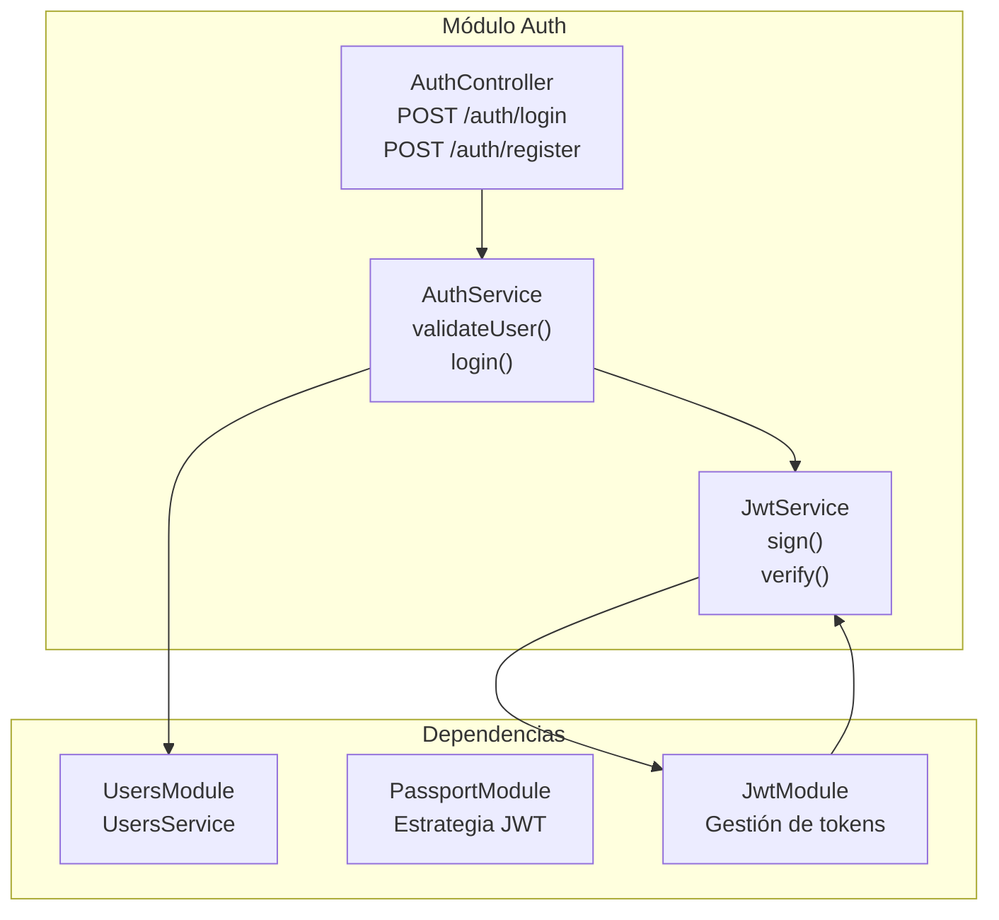
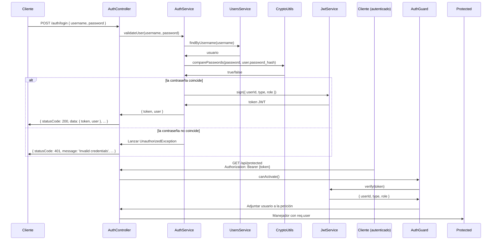

# Módulo Auth 🔐

El módulo Auth maneja la autenticación de usuarios, generación y validación de tokens JWT.

## Descripción General



## Estructura del Módulo

```
src/app/modules/auth/
├── controllers/
│   └── auth.controller.ts
├── services/
│   └── auth.service.ts
├── guards/
│   └── jwt-auth.guard.ts      # Legado basado en Passport
├── strategies/
│   └── jwt.strategy.ts        # Estrategia JWT de Passport
├── dtos/
│   ├── login.dto.ts
│   └── register.dto.ts
└── auth.module.ts
```

## Flujo de Autenticación

### Flujo de Login



## Servicios

### AuthService

Maneja la autenticación de usuarios:

```typescript
@Injectable()
export class AuthService {
  constructor(
    private usersService: UsersService,
    private jwtService: JwtService,
    private cryptoUtils: CryptoUtils,
  ) {}

  // Validar credenciales username/password
  async validateUser(username: string, password: string): Promise<any> {
    const user = await this.usersService.findUserByUsername(username);
    if (user && await this.cryptoUtils.comparePasswords(password, user.password_hash)) {
      const { password_hash, ...result } = user.toObject();
      return result;
    }
    return null;
  }

  // Crear token JWT a partir del usuario
  async login(user: any) {
    const payload = {
      userId: user._id,
      type: user.type,
      role: user.role,
    };
    return {
      access_token: this.jwtService.sign(payload),
      user,
    };
  }
}
```

**Ubicación**: `src/app/modules/auth/services/auth.service.ts`

## Controladores

### AuthController

```typescript
@Controller('auth')
export class AuthController {
  constructor(private authService: AuthService) {}

  @Post('login')
  async login(@Body() loginDto: LoginDto) {
    const user = await this.authService.validateUser(
      loginDto.username,
      loginDto.password,
    );
    
    if (!user) {
      throw new UnauthorizedException('Invalid credentials');
    }
    
    return this.authService.login(user);
  }

  @Post('register')
  async register(@Body() registerDto: RegisterDto) {
    // Registrar nuevo usuario (delega a UsersService)
    return this.usersService.createUser(registerDto);
  }
}
```

**Ubicación**: `src/app/modules/auth/controllers/auth.controller.ts`

## DTOs

### LoginDto

```typescript
export class LoginDto {
  @IsString()
  @MinLength(3)
  username: string;

  @IsString()
  @MinLength(6)
  password: string;
}
```

### RegisterDto

```typescript
export class RegisterDto {
  @IsString()
  @MinLength(3)
  username: string;

  @IsEmail()
  email: string;

  @IsStrongPassword()
  password: string;

  @IsString()
  name: string;

  @IsString()
  lastname: string;

  @IsEnum(UserType)
  type: UserType;
}
```

**Ubicación**: `src/app/modules/auth/dtos/`

## Estructura del Token JWT

El payload JWT contiene:

```json
{
  "userId": "507f1f77bcf86cd799439011",
  "type": "user",
  "role": {
    "_id": "507f1f77bcf86cd799439012",
    "name": "User",
    "permissions": [
      {
        "_id": "507f1f77bcf86cd799439013",
        "name": "Read Posts",
        "identifier": "posts:read"
      }
    ]
  },
  "iat": 1686479345,
  "exp": 1686565745
}
```

## Configuración de Seguridad

⚠️ **PROBLEMA DE SEGURIDAD**: El secreto JWT está hardcodeado en `auth.module.ts`:

```typescript
JwtModule.register({
  secret: 'yourSecretKey',  // ❌ ¡HARDCODEADO!
  signOptions: { expiresIn: '24h' },
})
```

**Debe usar variable de entorno**:
```typescript
secret: process.env.JWT_SECRET || 'fallback-secret',
```

Ver [Problema de Secretos Hardcodeados](../issues/hardcoded-secrets.md)

## Guards

### JwtAuthGuard (Legado)

Guard JWT basado en Passport (coexiste con el AuthGuard principal):

```typescript
@Injectable()
export class JwtAuthGuard extends AuthGuard('jwt') {
  canActivate(context: ExecutionContext): Promise<boolean> {
    return super.canActivate(context) as Promise<boolean>;
  }
}
```

**Ubicación**: `src/app/modules/auth/guards/jwt-auth.guard.ts`

### Core AuthGuard (Recomendado)

El guard de autenticación principal está en `core/guards/auth.guard.ts`. Usar el decorador `@Auth()` para proteger rutas:

```typescript
@Controller('users')
export class UsersController {
  @Get(':id')
  @Auth()  // Protegido con AuthGuard
  findOne(@Param('id') id: string) {
    // Solo usuarios autenticados pueden acceder
  }

  @Get()
  @Auth({ roles: ['admin'] })  // Solo administradores
  findAll() {
    // Solo usuarios admin pueden acceder
  }
}
```

## Estrategias

### JwtStrategy

Configuración de la estrategia JWT de Passport:

```typescript
@Injectable()
export class JwtStrategy extends PassportStrategy(Strategy) {
  constructor() {
    super({
      jwtFromRequest: ExtractJwt.fromAuthHeaderAsBearerToken(),
      ignoreExpiration: false,
      secretOrKey: 'yourSecretKey',  // ❌ También hardcodeado aquí
    });
  }

  async validate(payload: any) {
    return {
      userId: payload.userId,
      type: payload.type,
      role: payload.role,
    };
  }
}
```

**Ubicación**: `src/app/modules/auth/strategies/jwt.strategy.ts`

## Registro del Módulo

```typescript
@Module({
  imports: [
    PassportModule,
    JwtModule.register({
      secret: 'yourSecretKey',
      signOptions: { expiresIn: '24h' },
    }),
    UsersModule,
  ],
  controllers: [AuthController],
  providers: [AuthService, JwtStrategy],
  exports: [JwtModule, AuthService],
})
export class AuthModule {}
```

## Endpoints

| Endpoint | Método | Auth | Propósito |
|----------|--------|------|---------|
| `/auth/login` | POST | ❌ | Login con username/contraseña |
| `/auth/register` | POST | ❌ | Registrar nuevo usuario |

## Ejemplos de Petición/Respuesta

### Petición de Login

```bash
curl -X POST http://localhost:3000/auth/login \
  -H "Content-Type: application/json" \
  -d '{
    "username": "john_doe",
    "password": "SecurePass123!"
  }'
```

### Respuesta de Login (Éxito)

```json
{
  "statusCode": 200,
  "data": {
    "access_token": "eyJhbGciOiJIUzI1NiIsInR5cCI6IkpXVCJ9...",
    "user": {
      "_id": "507f1f77bcf86cd799439011",
      "username": "john_doe",
      "email": "john@example.com",
      "type": "user"
    }
  },
  "timestamp": "2024-06-13T12:34:56.789Z",
  "success": true
}
```

### Respuesta de Login (Fallo)

```json
{
  "statusCode": 401,
  "message": "Invalid credentials",
  "timestamp": "2024-06-13T12:34:56.789Z",
  "path": "/auth/login",
  "success": false
}
```

## Uso en Rutas

```typescript
@Controller('users')
export class UsersController {
  @Get('profile')
  @Auth()  // Protegido - requiere JWT válido
  getProfile(@CurrentUser() user: CurrentUserPayload) {
    return user;  // Devolver info del usuario actual
  }

  @Get('admin')
  @Auth({ roles: ['admin'] })  // Protegido - solo admins
  getAdminData() {
    return { admin: true };
  }

  @Get('public')
  // Sin @Auth() - endpoint público
  getPublic() {
    return { message: 'Public data' };
  }
}
```

## Documentación Relacionada

- [Guards Principales](../core/guards.md)
- [Módulo Users](./users.md)
- [Decoradores](../core/decorators.md)
- [Problema de Secretos Hardcodeados](../issues/hardcoded-secrets.md)

---

**Siguiente**: [Módulo Users →](./users.md)
