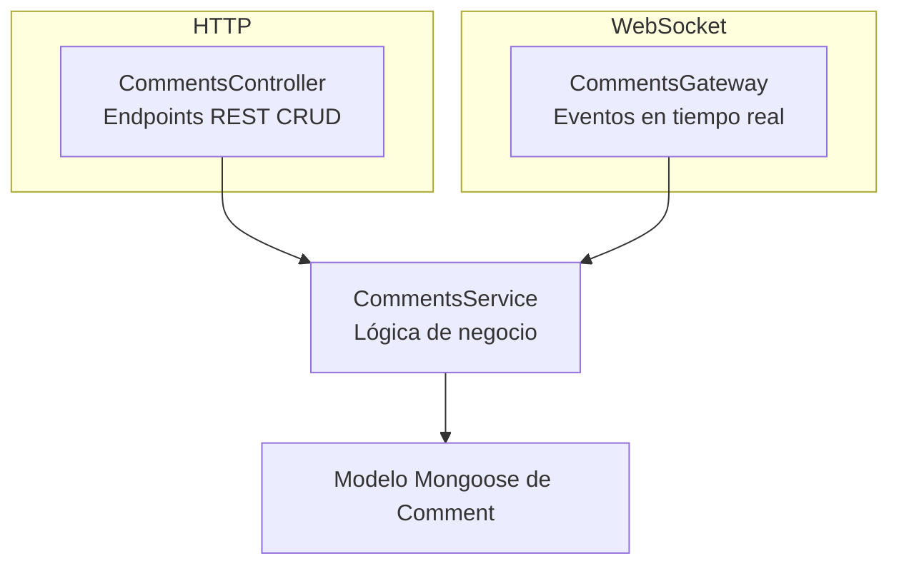

# Módulo Comments 💬

Gestiona los comentarios de posts con actualizaciones en tiempo real mediante el gateway WebSocket de Socket.IO.

## Descripción General



## Schema

```typescript
@Schema({ timestamps: true })
export class Comment {
  @Prop({ type: Schema.Types.ObjectId, ref: 'Post', required: true })
  postId: Post;

  @Prop({ required: true })
  name: string;

  @Prop({ required: true })
  email: string;

  @Prop({ required: true })
  body: string;

  @Prop({ default: true })
  isActive: boolean;

  @Prop({ default: false })
  isDeleted: boolean;

  createdAt?: Date;
  updatedAt?: Date;
}
```

## Controlador REST

```typescript
@Controller('comments')
export class CommentsController {
  constructor(private commentsService: CommentsService) {}

  @Post()
  createComment(@Body() createCommentDto: CreateCommentDto) {
    return this.commentsService.createComment(createCommentDto);
  }

  @Get('post/:postId')
  findByPost(@Param('postId') postId: string) {
    return this.commentsService.findByPostId(postId);
  }

  @Get(':id')
  findOne(@Param('id') id: string) {
    return this.commentsService.findById(id);
  }

  @Patch(':id')
  updateComment(
    @Param('id') id: string,
    @Body() updateCommentDto: UpdateCommentDto,
  ) {
    return this.commentsService.updateComment(id, updateCommentDto);
  }

  @Delete(':id')
  removeComment(@Param('id') id: string) {
    return this.commentsService.removeComment(id);
  }
}
```

## Gateway WebSocket

```typescript
@WebSocketGateway({
  namespace: '/comments',
  cors: {
    origin: '*',
  },
})
export class CommentsGateway
  implements OnGatewayInit, OnGatewayConnection, OnGatewayDisconnect
{
  @WebSocketServer()
  server: Server;

  private userConnections: Map<string, { userId: string; username: string }> = new Map();

  constructor(private commentsService: CommentsService) {}

  @SubscribeMessage('user:register')
  handleUserRegister(
    @MessageBody() data: { userId: string; username: string },
    @ConnectedSocket() client: Socket,
  ) {
    this.userConnections.set(client.id, data);
    this.server.emit('users:connected', Array.from(this.userConnections.values()));
  }

  @SubscribeMessage('comment:create')
  async handleCreateComment(
    @MessageBody() data: CreateCommentDto,
    @ConnectedSocket() client: Socket,
  ) {
    const comment = await this.commentsService.createComment(data);
    this.server.emit('comment:created', comment);
  }

  @SubscribeMessage('comment:update')
  async handleUpdateComment(
    @MessageBody() data: { id: string; body: string },
    @ConnectedSocket() client: Socket,
  ) {
    const comment = await this.commentsService.updateComment(data.id, data);
    this.server.emit('comment:updated', comment);
  }

  @SubscribeMessage('comment:delete')
  async handleDeleteComment(
    @MessageBody() id: string,
    @ConnectedSocket() client: Socket,
  ) {
    await this.commentsService.removeComment(id);
    this.server.emit('comment:deleted', id);
  }

  @SubscribeMessage('comments:list')
  async handleListComments(
    @MessageBody() postId: string,
    @ConnectedSocket() client: Socket,
  ) {
    const comments = await this.commentsService.findByPostId(postId);
    client.emit('comments:list', comments);
  }

  @SubscribeMessage('comment:typing')
  handleTyping(
    @MessageBody() data: { username: string },
    @ConnectedSocket() client: Socket,
  ) {
    client.broadcast.emit('comment:typing', data);
  }

  @SubscribeMessage('comment:typing:stop')
  handleTypingStop(
    @MessageBody() data: { username: string },
    @ConnectedSocket() client: Socket,
  ) {
    client.broadcast.emit('comment:typing:stop', data);
  }

  handleConnection(client: Socket) {
    console.log(`Client connected: ${client.id}`);
  }

  handleDisconnect(client: Socket) {
    this.userConnections.delete(client.id);
    this.server.emit('users:connected', Array.from(this.userConnections.values()));
    console.log(`Client disconnected: ${client.id}`);
  }
}
```

## Eventos del Socket

### Cliente → Servidor

| Evento | Payload | Propósito |
|-------|---------|---------|
| `user:register` | `{ userId, username }` | Registrar presencia del usuario |
| `comment:create` | `CreateCommentDto` | Crear comentario |
| `comment:update` | `{ id, body }` | Actualizar comentario |
| `comment:delete` | `id: string` | Eliminar comentario |
| `comments:list` | `postId: string` | Obtener todos los comentarios del post |
| `comment:typing` | `{ username }` | Usuario comenzó a escribir |
| `comment:typing:stop` | `{ username }` | Usuario dejó de escribir |

### Servidor → Cliente

| Evento | Payload | Propósito |
|-------|---------|---------|
| `comment:created` | `Comment` | Nuevo comentario creado |
| `comment:updated` | `Comment` | Comentario actualizado |
| `comment:deleted` | `id: string` | Comentario eliminado |
| `comments:list` | `Comment[]` | Respuesta con lista de comentarios |
| `users:connected` | `{ userId, username }[]` | Lista de usuarios conectados |
| `comment:typing` | `{ username }` | Usuario está escribiendo |
| `comment:typing:stop` | `{ username }` | Usuario dejó de escribir |

## Servicio

```typescript
@Injectable()
export class CommentsService {
  constructor(
    @InjectModel('Comment') private commentModel: Model<CommentDocument>,
    private postsService: PostsService,
  ) {}

  async createComment(createCommentDto: CreateCommentDto) {
    // Verificar que el post existe
    await this.postsService.findById(createCommentDto.postId);

    const comment = new this.commentModel(createCommentDto);
    return comment.save();
  }

  async findById(id: string) {
    const comment = await this.commentModel.findById(id).exec();
    if (!comment) {
      throw new NotFoundException('Comment not found');
    }
    return comment;
  }

  async findByPostId(postId: string) {
    return this.commentModel
      .find({ postId, isDeleted: false })
      .sort({ createdAt: -1 })
      .exec();
  }

  async updateComment(id: string, updateCommentDto: UpdateCommentDto) {
    return this.commentModel
      .findByIdAndUpdate(id, updateCommentDto, { new: true })
      .exec();
  }

  async removeComment(id: string) {
    return this.commentModel
      .findByIdAndUpdate(id, { isDeleted: true }, { new: true })
      .exec();
  }
}
```

## DTOs

```typescript
export class CreateCommentDto {
  @IsMongoId()
  postId: string;

  @IsString()
  @MinLength(2)
  name: string;

  @IsEmail()
  email: string;

  @IsString()
  @MinLength(5)
  body: string;
}

export class UpdateCommentDto {
  @IsOptional()
  @IsString()
  body?: string;
}
```

## Ejemplo de Cliente (Angular)

```typescript
import { Socket, io } from 'socket.io-client';

export class CommentsService {
  private socket: Socket;

  constructor() {
    this.socket = io('http://localhost:3000/comments');
  }

  registerUser(userId: string, username: string) {
    this.socket.emit('user:register', { userId, username });
  }

  createComment(comment: CreateCommentDto) {
    this.socket.emit('comment:create', comment);
  }

  listenForNewComments() {
    return new Observable(observer => {
      this.socket.on('comment:created', (comment) => {
        observer.next(comment);
      });
    });
  }

  listenForTyping() {
    return new Observable(observer => {
      this.socket.on('comment:typing', (data) => {
        observer.next(data);
      });
    });
  }
}
```

## Endpoints REST

| Endpoint | Método | Auth | Propósito |
|----------|--------|------|---------|
| `/comments` | POST | ❌ | Crear comentario |
| `/comments/post/:postId` | GET | ❌ | Obtener comentarios del post |
| `/comments/:id` | GET | ❌ | Obtener comentario por ID |
| `/comments/:id` | PATCH | ❌ | Actualizar comentario |
| `/comments/:id` | DELETE | ❌ | Eliminar comentario |

## Problemas de Seguridad ⚠️

1. **Sin autenticación en WebSocket**: El gateway no verifica tokens JWT
2. **Seguimiento de usuarios en memoria**: La presencia del usuario se almacena en memoria y se pierde al reconectar
3. **Sin comprobaciones de autorización**: Cualquier cliente conectado puede crear/actualizar/eliminar comentarios

Ver [Problemas de Seguridad WebSocket](../websocket/security.md)

## Nota Arquitectónica

Como Posts, este módulo usa el patrón Servicio → Modelo plano. Considerar refactorizar a Arquitectura Limpia para consistencia.

---

**Siguiente**: [Módulo Files →](./files.md)
