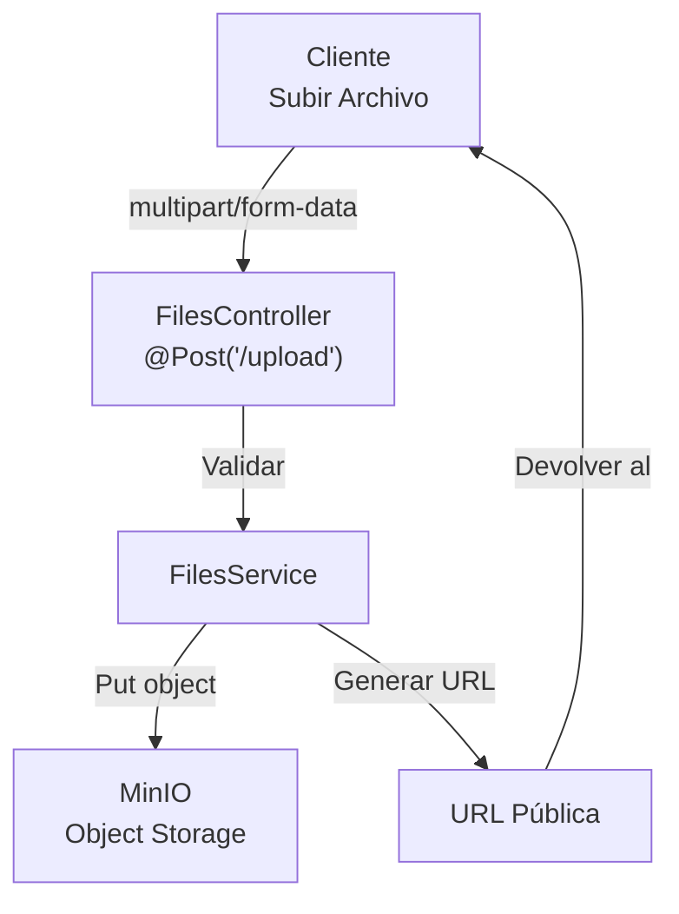

# Módulo Files 📁

Maneja la subida y el almacenamiento de archivos usando MinIO object storage.

## Descripción General



## Controlador

```typescript
@Controller('files')
export class FilesController {
  constructor(private filesService: FilesService) {}

  @Post('upload')
  @UseInterceptors(FileInterceptor('file', filesMulterOptions))
  @Auth()
  async uploadFile(@UploadedFile() file: Express.Multer.File) {
    if (!file) {
      throw new BadRequestException('No file provided');
    }

    const fileUrl = await this.filesService.uploadFile(file);
    return { url: fileUrl };
  }

  @Delete(':filename')
  @Auth()
  async deleteFile(@Param('filename') filename: string) {
    await this.filesService.deleteFile(filename);
    return { message: 'File deleted' };
  }
}
```

## Servicio

```typescript
@Injectable()
export class FilesService {
  private minioClient: Client;

  constructor() {
    this.minioClient = new Client({
      endPoint: process.env.MINIO_ENDPOINT || 'minio',
      port: 9000,
      useSSL: false,
      accessKey: process.env.MINIO_ACCESS_KEY || 'minioadmin',
      secretKey: process.env.MINIO_SECRET_KEY || 'minioadmin',
    });
  }

  async uploadFile(file: Express.Multer.File): Promise<string> {
    const bucketName = process.env.MINIO_BUCKET_NAME || 'posts';
    const fileName = FileUtils.generateFileName(file.originalname);

    try {
      await this.minioClient.putObject(
        bucketName,
        fileName,
        file.buffer,
        file.size,
        {
          'Content-Type': file.mimetype,
        },
      );

      const publicUrl = `${process.env.MINIO_PUBLIC_URL}/${bucketName}/${fileName}`;
      return publicUrl;
    } catch (error) {
      throw new BadRequestException(`Failed to upload file: ${error.message}`);
    }
  }

  async deleteFile(fileName: string): Promise<void> {
    const bucketName = process.env.MINIO_BUCKET_NAME || 'posts';

    try {
      await this.minioClient.removeObject(bucketName, fileName);
    } catch (error) {
      throw new BadRequestException(`Failed to delete file: ${error.message}`);
    }
  }

  async getFileUrl(fileName: string): Promise<string> {
    const bucketName = process.env.MINIO_BUCKET_NAME || 'posts';
    return `${process.env.MINIO_PUBLIC_URL}/${bucketName}/${fileName}`;
  }
}
```

## Configuración de Subida

```typescript
// multer-options.ts
export const filesMulterOptions = {
  storage: memoryStorage(),
  fileFilter: (req, file, cb) => {
    const allowedMimes = ['image/jpeg', 'image/png', 'image/gif', 'application/pdf'];
    if (allowedMimes.includes(file.mimetype)) {
      cb(null, true);
    } else {
      cb(new BadRequestException('File type not allowed'), false);
    }
  },
  limits: {
    fileSize: 5 * 1024 * 1024, // 5MB
  },
};
```

## Utilidades de Archivos

```typescript
export class FileUtils {
  static generateFileName(originalName: string): string {
    const extension = originalName.split('.').pop();
    const timestamp = Date.now();
    const random = Math.random().toString(36).substring(7);
    return `${timestamp}-${random}.${extension}`;
  }

  static validateFileSize(size: number, maxSize: number = 5 * 1024 * 1024): boolean {
    return size <= maxSize;
  }

  static isImageFile(mimetype: string): boolean {
    return ['image/jpeg', 'image/png', 'image/gif'].includes(mimetype);
  }
}
```

## Variables de Entorno

| Variable | Por Defecto | Propósito |
|----------|---------|---------|
| `MINIO_ENDPOINT` | `minio` | Dirección del servidor MinIO |
| `MINIO_ACCESS_KEY` | `minioadmin` | Clave de acceso MinIO |
| `MINIO_SECRET_KEY` | `minioadmin` | Clave secreta MinIO |
| `MINIO_BUCKET_NAME` | `posts` | Bucket por defecto |
| `MINIO_PUBLIC_URL` | `http://minio:9000` | URL pública para archivos |

## Endpoints

| Endpoint | Método | Auth | Propósito |
|----------|--------|------|---------|
| `/files/upload` | POST | ✅ | Subir archivo |
| `/files/:filename` | DELETE | ✅ | Eliminar archivo |

## Ejemplo de Cliente

```typescript
// Subida con FormData desde Angular
uploadFile(file: File) {
  const formData = new FormData();
  formData.append('file', file);

  return this.http.post('/files/upload', formData, {
    headers: this.getAuthHeaders(),
  });
}
```

## Configuración de MinIO

```bash
# Docker Compose
services:
  minio:
    image: minio/minio:latest
    ports:
      - "9000:9000"
      - "9001:9001"
    environment:
      MINIO_ROOT_USER: minioadmin
      MINIO_ROOT_PASSWORD: minioadmin
    volumes:
      - minio-data:/data
    command: server /data --console-address ":9001"

volumes:
  minio-data:
```

---

**Siguiente**: [Módulo Clients →](./clients.md)
