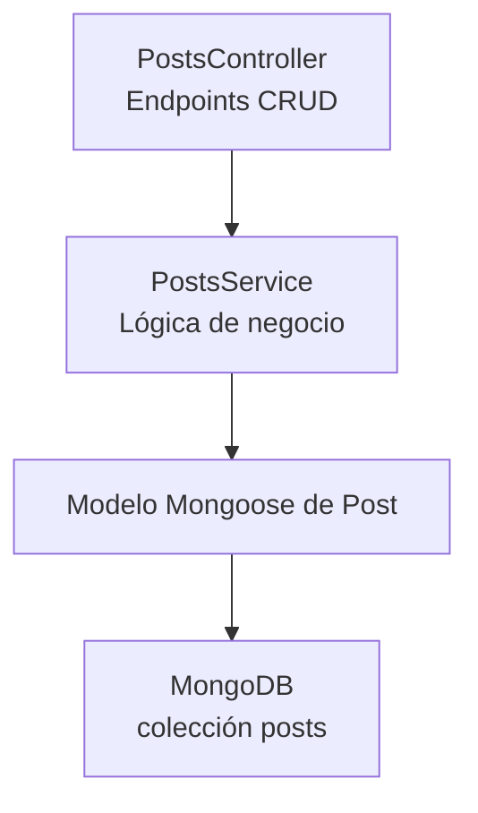

# Módulo Posts 📝

Gestiona los posts del blog con soporte para subida de imágenes opcionales.

## Descripción Rápida



## Schema

```typescript
@Schema({ timestamps: true })
export class Post {
  @Prop({ required: true })
  title: string;

  @Prop({ required: true })
  body: string;

  @Prop({ type: Schema.Types.ObjectId, ref: 'User' })
  author: User;

  @Prop()
  imageUrl?: string;

  @Prop()
  imageFilename?: string;

  @Prop({ default: true })
  isActive: boolean;

  @Prop({ default: false })
  isDeleted: boolean;

  createdAt?: Date;
  updatedAt?: Date;
}
```

## Controlador

```typescript
@Controller('posts')
export class PostsController {
  constructor(private postsService: PostsService) {}

  @Post()
  @Auth()
  createPost(
    @Body() createPostDto: CreatePostDto,
    @CurrentUser() user: CurrentUserPayload,
  ) {
    return this.postsService.createPost(createPostDto, user.userId);
  }

  @Get()
  findAll() {
    return this.postsService.findAll();
  }

  @Get(':id')
  findOne(@Param('id') id: string) {
    return this.postsService.findById(id);
  }

  @Patch(':id')
  @Auth()
  updatePost(
    @Param('id') id: string,
    @Body() updatePostDto: UpdatePostDto,
    @CurrentUser() user: CurrentUserPayload,
  ) {
    return this.postsService.updatePost(id, updatePostDto, user.userId);
  }

  @Delete(':id')
  @Auth()
  removePost(
    @Param('id') id: string,
    @CurrentUser() user: CurrentUserPayload,
  ) {
    return this.postsService.removePost(id, user.userId);
  }
}
```

## Servicio

```typescript
@Injectable()
export class PostsService {
  constructor(
    @InjectModel('Post') private postModel: Model<PostDocument>,
  ) {}

  async createPost(createPostDto: CreatePostDto, authorId: string) {
    const post = new this.postModel({
      ...createPostDto,
      author: authorId,
    });
    return post.save();
  }

  async findAll() {
    return this.postModel
      .find({ isDeleted: false })
      .populate('author', 'username email')
      .exec();
  }

  async findById(id: string) {
    const post = await this.postModel
      .findById(id)
      .populate('author', 'username email')
      .exec();
    
    if (!post) {
      throw new NotFoundException('Post not found');
    }
    return post;
  }

  async updatePost(id: string, updatePostDto: UpdatePostDto, userId: string) {
    const post = await this.findById(id);
    
    // Verificar autorización
    if (post.author._id.toString() !== userId) {
      throw new ForbiddenException('You can only edit your own posts');
    }

    return this.postModel
      .findByIdAndUpdate(id, updatePostDto, { new: true })
      .exec();
  }

  async removePost(id: string, userId: string) {
    const post = await this.findById(id);
    
    if (post.author._id.toString() !== userId) {
      throw new ForbiddenException('You can only delete your own posts');
    }

    return this.postModel
      .findByIdAndUpdate(id, { isDeleted: true }, { new: true })
      .exec();
  }
}
```

## DTOs

```typescript
export class CreatePostDto {
  @IsString()
  @MinLength(5)
  title: string;

  @IsString()
  @MinLength(10)
  body: string;

  @IsOptional()
  @IsUrl()
  imageUrl?: string;

  @IsOptional()
  @IsString()
  imageFilename?: string;
}

export class UpdatePostDto {
  @IsOptional()
  @IsString()
  title?: string;

  @IsOptional()
  @IsString()
  body?: string;

  @IsOptional()
  @IsUrl()
  imageUrl?: string;

  @IsOptional()
  @IsString()
  imageFilename?: string;
}
```

## Endpoints

| Endpoint | Método | Auth | Propósito |
|----------|--------|------|---------|
| `/posts` | POST | ✅ | Crear post |
| `/posts` | GET | ❌ | Obtener todos los posts |
| `/posts/:id` | GET | ❌ | Obtener post por ID |
| `/posts/:id` | PATCH | ✅ | Actualizar post (solo el dueño) |
| `/posts/:id` | DELETE | ✅ | Eliminar post (solo el dueño) |

## Nota Arquitectónica

Este módulo usa una **arquitectura plana** (Servicio → Modelo).

Para consistencia con el resto del código, considerar migrar a Arquitectura Limpia como el módulo Users al refactorizar.

---

**Siguiente**: [Módulo Comments →](./comments.md)
