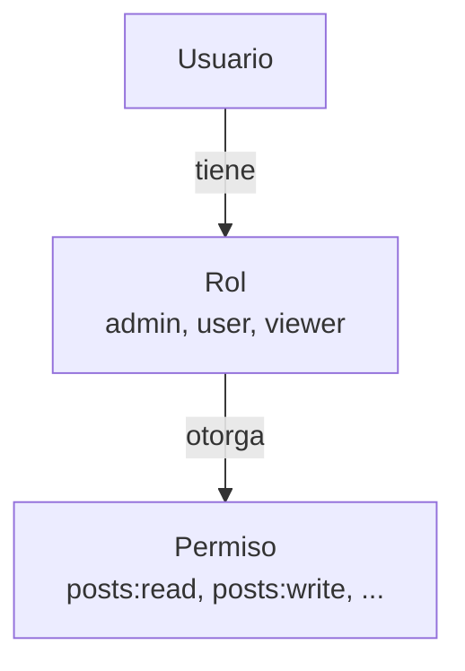

# Roles y Permisos 🎭🔑

Sistema de Control de Acceso Basado en Roles para permisos granulares.

## Descripción General



## Schema de Rol

```typescript
@Schema({ timestamps: true })
export class Role {
  @Prop({ required: true, unique: true })
  name: string;  // 'Admin', 'User', 'Viewer'

  @Prop({ required: true, unique: true })
  identifier: string;  // 'admin', 'user', 'viewer'

  @Prop({ type: [Schema.Types.ObjectId], ref: 'Permission', default: [] })
  permissions: Permission[];

  @Prop({ default: true })
  isActive: boolean;

  @Prop({ default: false })
  isDeleted: boolean;

  createdAt?: Date;
  updatedAt?: Date;
}
```

## Schema de Permiso

```typescript
@Schema({ timestamps: true })
export class Permission {
  @Prop({ required: true })
  name: string;  // 'Read Posts'

  @Prop({ required: true, unique: true })
  identifier: string;  // 'posts:read'

  @Prop({
    enum: ['user', 'roles', 'permissions', 'comments', 'clients', 'statistics', 'audits'],
  })
  type: string;  // Tipo de recurso

  @Prop({ default: true })
  isActive: boolean;

  @Prop({ default: false })
  isDeleted: boolean;

  createdAt?: Date;
  updatedAt?: Date;
}
```

## Estado de los Módulos

⚠️ **Ambos módulos están actualmente HUÉRFANOS** (no importados en AppModule)

Ver [Problema de Módulos Huérfanos](../issues/orphaned-modules.md)

## Endpoints (Cuando Se Corrija)

### Roles

| Endpoint | Método | Propósito |
|----------|--------|---------|
| `/roles` | POST | Crear rol |
| `/roles` | GET | Obtener todos los roles |
| `/roles/:id` | GET | Ver detalles del rol |
| `/roles/:id` | PATCH | Actualizar rol |
| `/roles/:id` | DELETE | Eliminar rol |

### Permisos

| Endpoint | Método | Propósito |
|----------|--------|---------|
| `/permissions` | POST | Crear permiso |
| `/permissions` | GET | Obtener todos los permisos |
| `/permissions/:id` | GET | Ver detalles del permiso |
| `/permissions/:id` | PATCH | Actualizar permiso |
| `/permissions/:id` | DELETE | Eliminar permiso |

## Uso en la Aplicación

### Asignar Rol a Usuario

```typescript
const user = await usersService.createUser({
  username: 'john',
  email: 'john@example.com',
  role: 'admin',  // Referencia al Rol
});
```

### Comprobar Permisos

```typescript
@Controller('posts')
export class PostsController {
  @Delete(':id')
  @Auth()
  @HasPermission('posts:delete')  // Comprobar permiso
  deletePost(@Param('id') id: string) {
    return this.postsService.deletePost(id);
  }
}
```

## Roles y Permisos por Defecto

Los datos semilla deben crear:

```typescript
// Roles
{
  name: 'Administrator',
  identifier: 'admin',
  permissions: [/* todos los permisos */]
}

{
  name: 'User',
  identifier: 'user',
  permissions: [
    'posts:read',
    'posts:create',
    'posts:update:own',
    'comments:read',
    'comments:create',
  ]
}

{
  name: 'Viewer',
  identifier: 'viewer',
  permissions: [
    'posts:read',
    'comments:read',
  ]
}

// Permisos
{
  name: 'Read Posts',
  identifier: 'posts:read',
  type: 'user'
}

{
  name: 'Create Post',
  identifier: 'posts:create',
  type: 'user'
}

{
  name: 'Update Own Post',
  identifier: 'posts:update:own',
  type: 'user'
}

{
  name: 'Delete Post',
  identifier: 'posts:delete',
  type: 'user'
}
```

## Nota Arquitectónica

Arquitectura plana (Servicio → Modelo). Considerar refactorizar a Arquitectura Limpia para consistencia.

---

**Siguiente**: [Módulo I18n →](./i18n.md)
