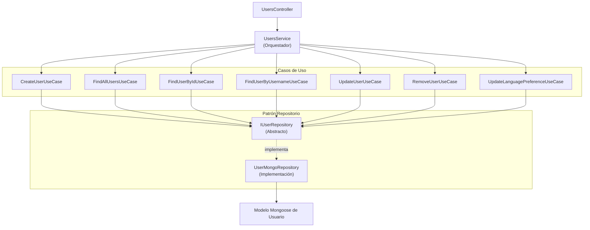

# Módulo Users 👥

El módulo Users gestiona las cuentas de usuario con implementación completa de **Arquitectura Limpia**.

## Descripción General

Este es el **único módulo** en el código que implementa el patrón completo de diseño orientado al dominio con casos de uso y repositorios.



## Estructura del Módulo

```
src/app/modules/users/
├── controllers/
│   └── users.controller.ts
├── services/
│   └── users.service.ts              # Orquestador
├── use-cases/
│   ├── create-user.use-case.ts
│   ├── find-all-users.use-case.ts
│   ├── find-user-by-id.use-case.ts
│   ├── find-user-by-username.use-case.ts
│   ├── update-user.use-case.ts
│   ├── remove-user.use-case.ts
│   └── update-language-preference.use-case.ts
├── repositories/
│   ├── user.repository.ts            # Interfaz abstracta
│   └── user.mongo.repository.ts      # Implementación con MongoDB
├── schemas/
│   └── user.schema.ts
├── dtos/
│   ├── create-user.dto.ts
│   └── update-user.dto.ts
├── types/
│   └── user-types.ts
└── users.module.ts
```

## Schema de Usuario

```typescript
@Schema({ timestamps: true })
export class User {
  @Prop({ required: true, unique: true })
  username: string;

  @Prop({ required: true, unique: true })
  email: string;

  @Prop({ required: true })
  password_hash: string;

  @Prop({ required: true })
  name: string;

  @Prop({ required: true })
  lastname: string;

  @Prop({ enum: UserType, default: UserType.USER })
  type: UserType;

  @Prop({ type: Schema.Types.ObjectId, ref: 'Role' })
  role: Role;

  @Prop({ default: true })
  isActive: boolean;

  @Prop({ default: false })
  isDeleted: boolean;

  @Prop({ enum: ['en', 'es'], default: 'en' })
  preferredLanguage: string;

  createdAt?: Date;
  updatedAt?: Date;
}
```

**Ubicación**: `src/app/modules/users/schemas/user.schema.ts`

## Servicios

### UsersService (Orquestador)

```typescript
@Injectable()
export class UsersService {
  constructor(
    @Inject('IUserRepository')
    private userRepository: IUserRepository,
    private createUserUseCase: CreateUserUseCase,
    private findAllUsersUseCase: FindAllUsersUseCase,
    private findUserByIdUseCase: FindUserByIdUseCase,
    private findUserByUsernameUseCase: FindUserByUsernameUseCase,
    private updateUserUseCase: UpdateUserUseCase,
    private removeUserUseCase: RemoveUserUseCase,
    private updateLanguagePreferenceUseCase: UpdateLanguagePreferenceUseCase,
  ) {}

  async createUser(createUserDto: CreateUserDto) {
    return this.createUserUseCase.execute(createUserDto);
  }

  async findAll() {
    return this.findAllUsersUseCase.execute();
  }

  async findUserById(id: string) {
    return this.findUserByIdUseCase.execute(id);
  }

  async findUserByUsername(username: string) {
    return this.findUserByUsernameUseCase.execute(username);
  }

  async updateUser(id: string, updateUserDto: UpdateUserDto) {
    return this.updateUserUseCase.execute(id, updateUserDto);
  }

  async removeUser(id: string) {
    return this.removeUserUseCase.execute(id);
  }

  async updateLanguagePreference(id: string, language: string) {
    return this.updateLanguagePreferenceUseCase.execute(id, language);
  }
}
```

**Ubicación**: `src/app/modules/users/services/users.service.ts`

## Casos de Uso

Cada caso de uso maneja una operación de negocio específica:

### CreateUserUseCase

```typescript
@Injectable()
export class CreateUserUseCase {
  constructor(
    @Inject('IUserRepository')
    private userRepository: IUserRepository,
    private cryptoUtils: CryptoUtils,
  ) {}

  async execute(createUserDto: CreateUserDto) {
    // Verificar si el username ya existe
    const existingUser = await this.userRepository.findByUsername(
      createUserDto.username,
    );
    if (existingUser) {
      throw new ConflictException('Username already exists');
    }

    // Hashear contraseña
    const hashedPassword = await this.cryptoUtils.hashPassword(
      createUserDto.password,
    );

    // Crear usuario
    return this.userRepository.create({
      ...createUserDto,
      password_hash: hashedPassword,
    });
  }
}
```

**Ubicación**: `src/app/modules/users/use-cases/create-user.use-case.ts`

### FindUserByIdUseCase

```typescript
@Injectable()
export class FindUserByIdUseCase {
  constructor(
    @Inject('IUserRepository')
    private userRepository: IUserRepository,
  ) {}

  async execute(id: string) {
    const user = await this.userRepository.findById(id);
    if (!user) {
      throw new NotFoundException('User not found');
    }
    return user;
  }
}
```

### Otros Casos de Uso

- `FindAllUsersUseCase` — Obtener todos los usuarios
- `FindUserByUsernameUseCase` — Buscar usuario por username
- `UpdateUserUseCase` — Actualizar datos del usuario
- `RemoveUserUseCase` — Borrado lógico del usuario
- `UpdateLanguagePreferenceUseCase` — Actualizar idioma preferido

**Ubicación**: `src/app/modules/users/use-cases/`

## Repositorios

### IUserRepository (Abstracto)

```typescript
export interface IUserRepository {
  create(user: CreateUserDto): Promise<User>;
  findAll(): Promise<User[]>;
  findById(id: string): Promise<User | null>;
  findByUsername(username: string): Promise<User | null>;
  update(id: string, user: UpdateUserDto): Promise<User>;
  delete(id: string): Promise<void>;
}
```

**Ubicación**: `src/app/modules/users/repositories/user.repository.ts`

### UserMongoRepository (Implementación)

```typescript
@Injectable()
export class UserMongoRepository implements IUserRepository {
  constructor(@InjectModel('User') private userModel: Model<UserDocument>) {}

  async create(createUserDto: CreateUserDto): Promise<User> {
    const createdUser = new this.userModel(createUserDto);
    return createdUser.save();
  }

  async findAll(): Promise<User[]> {
    return this.userModel.find({ isDeleted: false }).exec();
  }

  async findById(id: string): Promise<User | null> {
    return this.userModel.findById(id).exec();
  }

  async findByUsername(username: string): Promise<User | null> {
    return this.userModel.findOne({ username }).exec();
  }

  async update(id: string, updateUserDto: UpdateUserDto): Promise<User> {
    return this.userModel.findByIdAndUpdate(id, updateUserDto, { new: true }).exec();
  }

  async delete(id: string): Promise<void> {
    await this.userModel.findByIdAndUpdate(id, { isDeleted: true }).exec();
  }
}
```

**Ubicación**: `src/app/modules/users/repositories/user.mongo.repository.ts`

## Controlador

```typescript
@Controller('users')
export class UsersController {
  constructor(private usersService: UsersService) {}

  @Post()
  @Auth()  // Protegido - solo admin
  createUser(@Body() createUserDto: CreateUserDto) {
    return this.usersService.createUser(createUserDto);
  }

  @Get()
  @Auth()  // Protegido
  findAll() {
    return this.usersService.findAll();
  }

  @Get(':id')
  @Auth()  // Protegido
  findOne(@Param('id') id: string) {
    return this.usersService.findUserById(id);
  }

  @Patch(':id')
  @Auth()  // Protegido
  updateUser(@Param('id') id: string, @Body() updateUserDto: UpdateUserDto) {
    return this.usersService.updateUser(id, updateUserDto);
  }

  @Delete(':id')
  @Auth()  // Protegido - solo admin
  removeUser(@Param('id') id: string) {
    return this.usersService.removeUser(id);
  }

  @Patch(':id/language')
  @Auth()  // Protegido
  updateLanguagePreference(
    @Param('id') id: string,
    @Body() { language }: { language: string },
  ) {
    return this.usersService.updateLanguagePreference(id, language);
  }
}
```

**Ubicación**: `src/app/modules/users/controllers/users.controller.ts`

## DTOs

### CreateUserDto

```typescript
export class CreateUserDto {
  @IsString()
  @MinLength(3)
  username: string;

  @IsEmail()
  email: string;

  @IsString()
  @MinLength(2)
  name: string;

  @IsString()
  @MinLength(2)
  lastname: string;

  @IsStrongPassword()
  password: string;

  @IsEnum(UserType)
  type: UserType;
}
```

### UpdateUserDto

```typescript
export class UpdateUserDto {
  @IsOptional()
  @IsEmail()
  email?: string;

  @IsOptional()
  @IsString()
  name?: string;

  @IsOptional()
  @IsString()
  lastname?: string;

  @IsOptional()
  @IsEnum(UserType)
  type?: UserType;
}
```

**Ubicación**: `src/app/modules/users/dtos/`

## Registro del Módulo

```typescript
@Module({
  imports: [
    MongooseModule.forFeature([{ name: 'User', schema: UserSchema }]),
  ],
  controllers: [UsersController],
  providers: [
    UsersService,
    CreateUserUseCase,
    FindAllUsersUseCase,
    FindUserByIdUseCase,
    FindUserByUsernameUseCase,
    UpdateUserUseCase,
    RemoveUserUseCase,
    UpdateLanguagePreferenceUseCase,
    {
      provide: 'IUserRepository',
      useClass: UserMongoRepository,
    },
  ],
  exports: [UsersService, 'IUserRepository'],
})
export class UsersModule {}
```

## Endpoints

| Endpoint | Método | Auth | Propósito |
|----------|--------|------|---------|
| `/users` | POST | ✅ Admin | Crear usuario |
| `/users` | GET | ✅ | Obtener todos los usuarios |
| `/users/:id` | GET | ✅ | Obtener usuario por ID |
| `/users/:id` | PATCH | ✅ | Actualizar usuario |
| `/users/:id` | DELETE | ✅ Admin | Eliminar usuario |
| `/users/:id/language` | PATCH | ✅ | Actualizar preferencia de idioma |

## Beneficios de la Arquitectura Limpia

1. **Testabilidad**: Los casos de uso pueden probarse de forma independiente con repositorios mock
2. **Mantenibilidad**: Clara separación de responsabilidades
3. **Flexibilidad**: Fácil de cambiar MongoDB por PostgreSQL (implementar nuevo Repositorio)
4. **Escalabilidad**: Se pueden agregar nuevos casos de uso sin modificar el código existente
5. **Enfoque en el Dominio**: La lógica de negocio está desacoplada de la infraestructura

## Ejemplo: Probar un Caso de Uso

```typescript
describe('CreateUserUseCase', () => {
  let useCase: CreateUserUseCase;
  let mockRepository: Partial<IUserRepository>;

  beforeEach(() => {
    mockRepository = {
      create: jest.fn(),
      findByUsername: jest.fn().mockResolvedValue(null),
    };
    useCase = new CreateUserUseCase(
      mockRepository as IUserRepository,
      new CryptoUtils(),
    );
  });

  it('should create a user', async () => {
    const dto: CreateUserDto = {
      username: 'john',
      email: 'john@example.com',
      password: 'SecurePass123!',
      name: 'John',
      lastname: 'Doe',
      type: UserType.USER,
    };

    await useCase.execute(dto);

    expect(mockRepository.create).toHaveBeenCalled();
  });
});
```

---

**Siguiente**: [Módulo Posts →](./posts.md)
