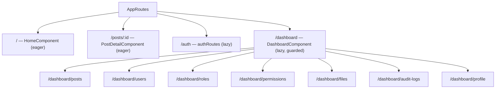

# Project Structure

## Directory Tree

```
src/app/
├── core/
│   ├── components/         # Singleton UI: sidebar, language-switcher
│   ├── directives/         # has-permission, has-role
│   ├── guards/             # auth.guard, permission.guard
│   ├── interceptors/       # jwt.interceptor, error.interceptor
│   ├── pipes/              # translate.pipe
│   └── services/           # api, websocket, i18n, toast, files,
│                           #   notifications, permissions, realtime-notifier
├── features/
│   ├── admin/              # Shared admin utilities
│   │   ├── interfaces/
│   │   ├── pipes/
│   │   ├── services/       # AdminBaseService
│   │   ├── types/
│   │   └── utils/          # Pagination, filter helpers
│   ├── auth/               # Login, register, NgRx store, validators
│   │   ├── directives/
│   │   ├── pages/
│   │   ├── pipes/
│   │   ├── store/          # actions, reducer, effects, selectors
│   │   └── validators/
│   ├── client/             # End-user pages (redirected to /home)
│   │   ├── components/
│   │   └── pages/          # feed, my-posts, my-favorites, my-comments, profile
│   ├── dashboard/          # Admin shell and all admin pages
│   │   └── pages/          # overview, users, roles, permissions, files, audit-logs
│   ├── home/               # Public home page
│   │   └── pages/
│   ├── posts/              # Post detail
│   │   ├── components/     # comment-form, comment-item, reply-form
│   │   └── interfaces/
│   └── profile/            # Profile routes
└── shared/
    └── models/             # notification.model
```

---

## Architecture Layers

### Core

Contains **singleton infrastructure** shared across the entire application. Every service in `core/services/` uses `providedIn: 'root'`, making them application-wide singletons. Guards and interceptors are also registered here. Nothing in `core/` should depend on a feature module.

### Features

Self-contained vertical slices of the application. Each feature folder owns its components, pages, services, types, and interfaces. Features communicate through `core/` services (e.g., `WebSocketService`, `ApiService`) and the NgRx store for auth state — never by importing from each other directly.

The `admin/` feature is an exception: it acts as a **shared admin utilities layer** (not a routable feature) used by `dashboard/`. It provides `AdminBaseService`, pagination utilities, and filter interfaces that dashboard pages extend.

### Shared

Holds cross-feature data models (`notification.model`) that cannot belong to a single feature. Keep this layer thin — move anything with behavior into `core/` or the relevant feature.

---

## Standalone Components

This app uses **no NgModules for feature code**. Every component, directive, and pipe is declared as `standalone: true` and imports its dependencies directly. Providers that would traditionally go in a module are registered in `app.config.ts` (the application bootstrap config).

Benefits:
- Explicit dependency graph per component
- Tree-shaking at the component level
- Simplified testing (`TestBed.configureTestingModule` with only what the component needs)

---

## Lazy Loading Strategy



- Public routes (`/`, `/posts/:id`) are eagerly loaded — they must be available for SSR on first render.
- `/auth` and `/dashboard` are lazy-loaded. The dashboard shell and all its children are gated behind `authGuard` and `dashboardGuard`.
- Dashboard children are declared inline under the parent route (eagerly loaded once the dashboard shell loads), keeping the admin bundle cohesive.
