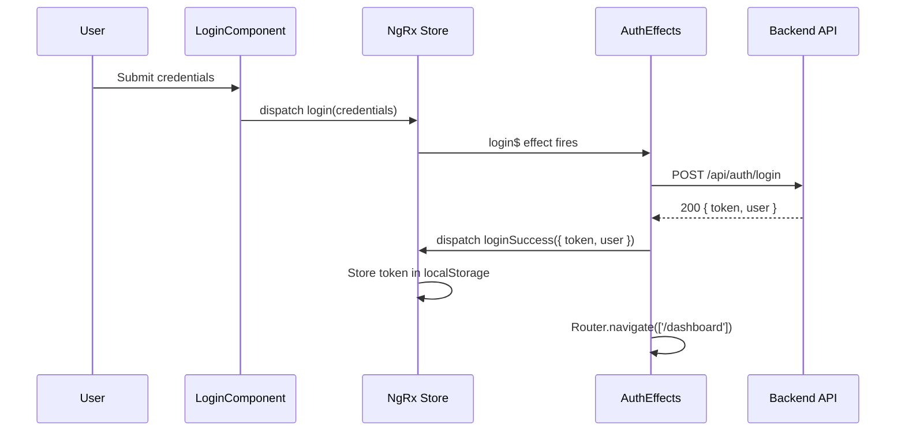

# Features Overview

## Route Map

| Path | Component | Access |
|---|---|---|
| `/` | HomeComponent | Public |
| `/home` | HomeComponent | Public (alias) |
| `/posts/:id` | PostDetailComponent | Public |
| `/auth` | AuthComponent | Public (with child routes) |
| `/auth/login` | LoginComponent | Public |
| `/auth/register` | RegisterComponent | Public |
| `/dashboard` | DashboardComponent | `authGuard` + `dashboardGuard` |
| `/dashboard/posts` | Posts management | Guarded |
| `/dashboard/users` | UsersComponent | Guarded |
| `/dashboard/roles` | RolesComponent | Guarded |
| `/dashboard/permissions` | PermissionsComponent | Guarded |
| `/dashboard/files` | FilesComponent | Guarded |
| `/dashboard/profile` | Profile routes | Guarded |
| `/dashboard/audit-logs` | AuditLogsComponent | Guarded |
| `/client` | — | Redirects to `/home` |

---

## Feature Details

### Auth (`/auth`)

Handles user authentication end-to-end:

- **Login** — email/password form with reactive validation. On submit, dispatches the `login` NgRx action. `AuthEffects` calls the backend, then dispatches `loginSuccess` (stores JWT to `localStorage` key `auth_token`) or `loginFailure`.
- **Register** — registration form with custom validators. Dispatches `register` → `registerSuccess` / `registerFailure`.
- **State** — NgRx store holds `{ user, token, loading, error }`. On app init, `loadAuthFromStorage` rehydrates token from `localStorage`.
- **Redirect** — on `loginSuccess`, the effect navigates the user to `/dashboard`.

---

### Home (`/`, `/home`)

Public landing page that displays published posts. No authentication required. Rendered server-side on first load (SSR) for fast initial paint.

---

### Posts (`/posts/:id`)

Public post detail page. Displays the full post content and its comment thread. The comment form and reaction controls are rendered for all visitors; posting a comment requires a valid JWT (enforced by `JwtInterceptor` on the API call, not by a route guard).

Real-time updates: the page subscribes to the `/comments` Socket.IO namespace to receive `comment:created`, `reply:created`, and `reaction:added` events without polling.

---

### Dashboard (`/dashboard`)

Admin shell. Protected by two guards that run in sequence:

1. `authGuard` — verifies `auth_token` is present in `localStorage`; redirects to `/auth/login` if missing.
2. `dashboardGuard` — checks the authenticated user's permissions via `PermissionsService`; blocks access if the user lacks admin privileges.

Child pages under `/dashboard/`:

| Page | Responsibility |
|---|---|
| Overview | Summary stats and activity feed |
| Posts | Full CRUD for all posts |
| Users | User management (create, edit, activate, deactivate) |
| Roles | Role definitions |
| Permissions | Permission assignments |
| Files | File upload and management |
| Audit Logs | Read-only event log |
| Profile | Authenticated user's own profile |

All dashboard pages receive real-time updates via the relevant Socket.IO namespace (e.g., `/users` namespace pushes `user:created`, `user:updated` events to the users page).

---

### Client (redirects to `/home`)

The `/client` route redirects to `/home`. The `features/client/` directory still contains page components (`my-posts`, `my-favorites`, `my-comments`, `profile`) that are available as internal components but are not currently exposed via routable paths.

---

## Route Guards

### `authGuard` (`core/guards/auth.guard.ts`)

A functional guard that checks for `auth_token` in `localStorage`. If the token is absent or expired, it cancels navigation and redirects to `/auth/login`. Applied to the `/dashboard` route.

### `dashboardGuard` (`core/guards/permission.guard.ts`)

A permission-based guard that runs after `authGuard`. It uses `PermissionsService` to verify the current user holds the required permissions for dashboard access. If the check fails, the guard cancels navigation (typically redirects to `/home` or shows an unauthorized page).
